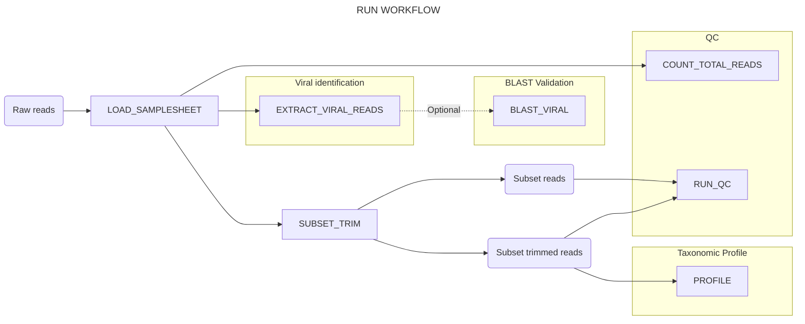

# Nucleic Acid Observatory Viral Metagenomics Pipeline

This Nextflow pipeline is designed to process metagenomic sequencing data, characterize overall taxonomic composition, and identify and quantify reads mapping to viruses infecting certain host taxa of interest. It was developed as part of the [Nucleic Acid Observatory](https://naobservatory.org/) project.

## Documentation

- **Installation and usage:**
    - [Installation instructions](docs/installation.md)
    - [AWS Batch setup](docs/batch.md)
    - [Usage instructions](docs/usage.md)
    - [Troubleshooting](docs/troubleshooting.md)
- **Workflow details:**
    - [Index workflow](docs/index.md)
    - [Run workflow](docs/run.md)
- **Configuration and output:**
    - [Configuration files](docs/configs.md)
    - [Pipeline outputs](docs/output.md)
- **Other:**
    - [Version Schema](docs/version_schema.md)

## Overview

The pipeline currently consists of three workflows:

- [`index`](./docs/index.md): Creates indices and reference files used by the `run` workflow. Intended to be run first.
- [`run`](./docs/run.md): Performs the main analysis, including viral identification, taxonomic profiling, and optional BLAST validation.
- `run_validation`: Performs part of the `run` workflow dedicated to validation of taxonomic classification with BLAST.[^2]

[^1]: The `index` workflow is intended to be run first, after which many instantiations of the `run` workflow can use the same index output files. 
[^2]: The `run_validation` workflow is intended to be run after the `run` workflow if the optional BLAST validation was not selected during the `run` workflow. Typically, this workflow is run on a subset of the host viral reads identified in the `run` workflow, to evaluate the sensitivity and specificity of the viral identification process.

The `run` workflow consists of four parts:

- **Viral identification**: Reads from viruses infecting specific host taxa of interest (default: vertebrate viruses) are sensititvely and specifically identified using a multi-step pipeline based around k-mer filtering, adapter trimming, read alignment, and taxonomic classification.
- **Taxonomic profile**: A random subset of reads (default: 1M/sample) undergo adapter trimming, ribosomal classification, and taxonomic classification.
- **QC**: The total number of reads are recorded, then a subset of reads (default 1M/sample) undergo quality assessment, both before and after adapter trimming.
- **(Optional) BLAST validation**: Putative host viral reads from part 1 (either all reads or a subset) are checked aginst `core_nt` to evaluate the sensitivity and specificity of the viral identification process.

The following diagram provides a high-level overview of the `run` workflow (each blue box is a subworkflow). See the documentation links above for more information, including detailed [installation](./docs/installation.md) and [usage](./docs/usage.md) instructions.

