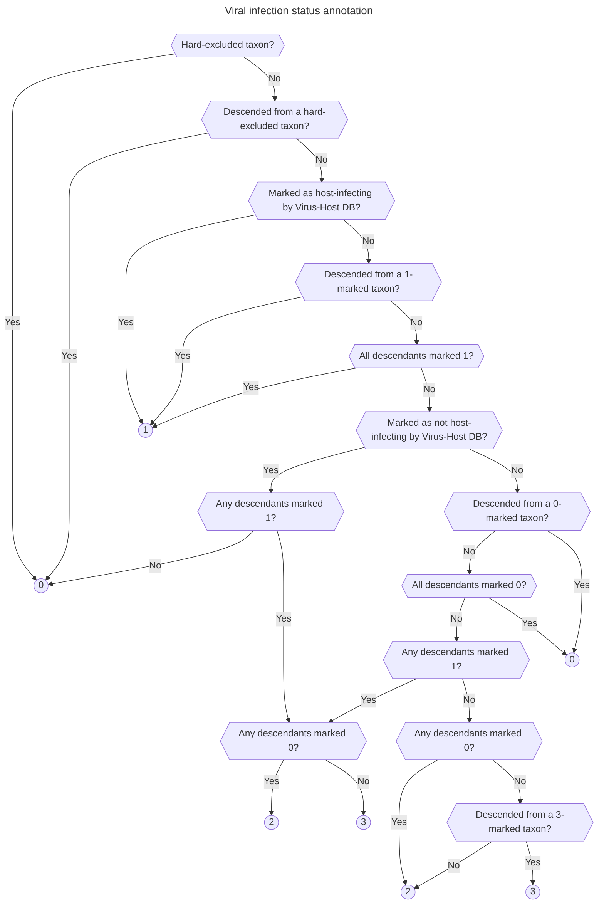

# Viral infection status annotation

As part of the [index workflow](./index.md), the pipeline generates a database of all viral taxa from the [NCBI Taxonomy](https://www.ncbi.nlm.nih.gov/taxonomy), annotating each with its taxonomic ID (taxid), parent taxid in the taxonomy tree, and infection status for a range of host taxa of interest[^1] (e.g. humans, vertebrates). This host infection status is determined from the infection information provided by [Virus-Host DB](https://www.genome.jp/virushostdb/), and is stored as a four-state integer series for each host taxon of interest:

[^1]: By default, the pipeline generates these annotations for humans, primates, mammals, vertebrates, and birds. These were selected as taxa for which infecting viruses are of potential interest in a human biosurveillance context. The host taxa to be included can be changed by modifying `params.host_taxon_db` in the index workflow's config file.

- An infection status of **1** designates taxa that are affirmatively marked as infecting that host group. It includes taxa that are directly marked in Virus-Host DB as infecting that host group; taxa that are descended from such taxa; and taxa whose descendants are all marked 1.
- An infection status of **0** designates taxa that are marked as not infecting that host group. It includes taxa that: are included in Virus-Host DB; are not marked in Virus-Host DB as infecting that host group; and have no 1-marked descendants. It also includes taxa that are descended from such taxa, and taxa whose descendants are all marked 0.
- An infection status of **3** designates taxa that are likely to infect that host group, but cannot be affirmatively marked as such. It includes taxa that are not included in Virus-Host DB, have at least one 1-marked descendant, and no 0-marked descendants[^2]. It also includes all taxa that are descended from such taxa and cannot be marked 1 according to the rules above, as well as taxa whose descendants are all marked 3.
- Finally, an infection status of **2** designates taxa of uncertain infection status. It includes all other taxa: those that are not included in Virus-Host DB and have both 0- and 1-marked descendants; those descended from a 2-marked taxon that are not given another status by the rules above; and those whose descendants are all marked 2.

[^2]: The central example of this is a virus taxon with many children, only one of which is included in Virus-Host DB (with infection status 1). In this case, neither the parent node nor the unmarked children can be given an annotation of 1, but it would be misleading to mark them as 0. Under the current implementation, all of these nodes (except the 1-marked child) would be marked 3.

Some taxa are *hard-excluded* by the user via the index workflow's config file; any such taxon, and all its descendants, are automatically marked with an infection status of 0. This is useful for cases where we believe Virus-Host DB has misannotated certain taxa (such as human-gut-colonizing phages) in ways that give rise to misleading results in our pipeline.

This somewhat complex system allows downstream analysis to distinguish between different degrees of confidence in the host infection status associated with a viral taxon, which can be important in e.g. evaluating the performance of the pipeline on a given dataset.

## Algorithmic Implementation

The script determines the host infection status for each viral taxon by executing a three-phase algorithm. This process is performed independently for each host group (e.g., "human", "vertebrates") to produce the final classification.

### Intermediate States

The algorithm uses two temporary states during processing that are never present in the final output:

1. **`UNRESOLVED` (-1):** Taxa that are not found in the Virus-Host DB. This is a placeholder used during the initial marking phase to indicate that we have no direct evidence about this taxon's infection status. These are replaced with the appropriate status either during the upward or downward propagation described below.

2. **`MAYBE_INCONSISTENT` (-2):** A special intermediate state used during the upward propagation phase. This state is assigned to parent taxa that have at least one **`INCONSISTENT`** child (where the other children are **`UNRESOLVED`**, **`INCONSISTENT`**, or **`MAYBE_INCONSISTENT`**) but are not themselves directly marked as **`INCONSISTENT`** in the database. This prevents premature assignment of the **`UNCLEAR`** (2) status and allows the algorithm to correctly propagate **`INCONSISTENT`** status downward in Phase 3 when appropriate. Without this intermediate state, the algorithm could incorrectly mark entire clades as **`UNCLEAR`** when they should be **`INCONSISTENT`**. For detailed examples and edge cases, see this [SecureBio private doc](https://docs.google.com/document/d/1j_V6Kjt4c9Iwx9bsnYixhX2dJv6tIIsFKeBBfvGls8U/edit?usp=sharing).

### Phase 1: Initialization

This phase sets the baseline status for each taxon based on direct evidence.

1.  **Direct Marking** (`mark_direct_infections`): Before performing this step, we call `expand_taxid` to get all descendants of the host taxon. The script then performs an initial scan of all viral taxa against the Virus-Host DB.
    * **`MATCH` (1):** The taxon is explicitly linked to the host group or any of its descendants in the database.
    * **`INCONSISTENT` (0):** The taxon is present in the database but is *not* linked to the host group.
    * **`UNRESOLVED` (-1):** The taxon is not found in the database.

2.  **Hard Exclusions** (`exclude_infections`): User-defined "hard-excluded" taxa and all of their descendants are immediately set to **`INCONSISTENT` (0)**, overriding any status set in the previous step.

### Phase 2: Upward Propagation (Ancestor Inference)

This is the most complex phase of the algorithm, using recursion to infer a parent's status from its children. It effectively works from the leaves of the tree upwards to the root. The logic is handled by `mark_ancestor_infections` and its recursive helper, `mark_ancestor_infections_single`.

### Initial State and the `checked` Flag

An important detail is how the process is initiated. Before recursion begins, any taxon that is already a **`MATCH` (1)** or is a leaf node (has no children) is immediately marked as **`checked`**.

The **`checked`** flag serves as a "finalized" marker for this upward pass. The main loop in `mark_ancestor_infections` intentionally skips any taxon that is already **`checked`**. Because of this, the recursive function is only ever called on parent nodes whose initial status is **`INCONSISTENT` (0)** or **`UNRESOLVED` (-1)**. A confirmed **`MATCH`** status is never overwritten during this phase.

### The Recursive Process

The algorithm's flow for a given parent taxon (`P`) is as follows:

1.  **Check Children:** The function first examines the immediate children of `P`.
2.  **Recursive Descent:** If any child is *not* **`checked`**, the function calls itself on that child. This creates a chain of recursive calls down a branch of the tree until it reaches nodes that are already **`checked`** (i.e., leaves or previously solved sub-trees).
3.  **Upward Return:** As the recursive calls resolve and return, the statuses of the children become known, and they are marked **`checked`**.
4.  **Parent Inference:** Once all children of `P` are **`checked`**, the algorithm can finally infer the status of `P` using the rules below. After its status is calculated, `P` itself is marked **`checked`**, and the function returns, allowing its own parent's evaluation to proceed.

This flow ensures that a parent is only evaluated after all of its descendants have been fully resolved.

### Inference Rules

Once all of a parent's children are **`checked`**, its own status is determined by applying these rules **in order**. Each rule is evaluated sequentially, and if a rule's condition is met, that rule determines the parent's status and no further rules are evaluated. If a rule's condition is not met, the algorithm continues to the next rule with a refined understanding of what states the children must be in.

* **Rule 1:** If all children are **`UNRESOLVED`**, the parent remains **`UNRESOLVED`**.
  * *If this rule doesn't apply:* At least one child has a resolved status (not **`UNRESOLVED`**).

* **Rule 2:** If all children share the exact same status, the parent inherits it.
  * *If this rule doesn't apply:* There are at least two children with different statuses.

* **Rule 3:** If any child is **`UNCLEAR` (2)**, the parent is marked **`UNCLEAR`**.
  * *If this rule doesn't apply:* No children are **`UNCLEAR`**. The children must be a mix of **`INCONSISTENT`**, **`MATCH`**, **`CONSISTENT`**, **`UNRESOLVED`**, or **`MAYBE_INCONSISTENT`**.

* **Rule 4:** If children include a mix of positive evidence (**`MATCH`** or **`CONSISTENT`**) and negative evidence (**`INCONSISTENT`** or **`MAYBE_INCONSISTENT`**), the parent is marked **`UNCLEAR`**.
  * *If this rule doesn't apply:* Children are either all non-positive (**`INCONSISTENT`**, **`UNRESOLVED`**, or **`MAYBE_INCONSISTENT`**) or all non-negative (**`MATCH`**, **`CONSISTENT`**, or **`UNRESOLVED`**).

* **Rule 5:** If any children are **`INCONSISTENT`** or **`MAYBE_INCONSISTENT`**, set the parent to **`MAYBE_INCONSISTENT`** if the parent is not **`INCONSISTENT`**; otherwise, keep as **`INCONSISTENT`**.
  * *If this rule doesn't apply:* All children must be **`MATCH`**, **`CONSISTENT`**, or **`UNRESOLVED`**.

* **Rule 6:** If children contain **`MATCH`** or **`CONSISTENT`** taxa (and, based on the rules above, no **`INCONSISTENT`** or **`UNCLEAR`** ones), the parent is marked **`CONSISTENT` (3)**. 

### Phase 3: Downward Propagation

After the upward pass is complete, this phase ensures that clade-level classifications are applied consistently down the tree. The `mark_descendant_infections` function handles this logic.

* Any descendant of a **`MATCH`** parent is set to **`MATCH`**.
* Any descendant of an **`INCONSISTENT`** parent is set to **`INCONSISTENT`**.
* A descendant of a **`CONSISTENT`** parent becomes **`CONSISTENT`**, unless it is already marked as **`MATCH`**.
* A descendant of an **`UNCLEAR`** parent becomes **`UNCLEAR`** if it is marked as **`UNRESOLVED`** or **`MAYBE_INCONSISTENT`**.

At the end of this phase, all temporary statuses (**`UNRESOLVED`**, **`MAYBE_INCONSISTENT`**) are resolved, and each taxon has its final 0, 1, 2, or 3 status.
