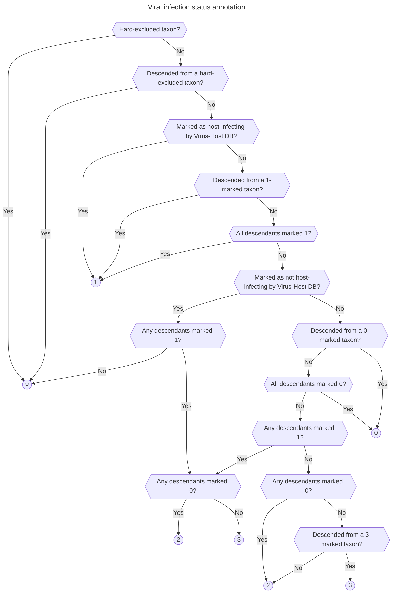

# Viral infection status annotation

As part of the [index workflow](./index.md), the pipeline generates a database of all viral taxa from the [NCBI Taxonomy](https://www.ncbi.nlm.nih.gov/taxonomy), annotating each with its taxonomic ID (taxid), parent taxid in the taxonomy tree, and infection status for a range of host taxa of interest (e.g. humans, vertebrates). This host infection status is determined from the infection information provided by [Virus-Host DB](https://www.genome.jp/virushostdb/), and is stored as a four-state integer series for each host taxon of interest:

- An infection status of **1** designates taxa that are affirmatively marked as infecting that host group. It includes taxa that are directly marked in Virus-Host DB as infecting that host group; taxa that are descended from such taxa; and taxa whose descendants are all marked 1.
- An infection status of **0** designates taxa that are marked as not infecting that host group. It includes taxa that: are included in Virus-Host DB; are not marked in Virus-Host DB as infecting that host group; and have no 1-marked descendants. It also includes taxa that are descended from such taxa, and taxa whose descendants are all marked 0.
- An infection status of **3** designates taxa that are likely to infect that host group, but cannot be affirmatively marked as such. It includes taxa that are not included in Virus-Host DB, have at least one 1-marked descendant, and no 0-marked descendants. It also includes all taxa that are descended from such taxa and cannot be marked 1 according to the rules above, as well as taxa whose descendants are all marked 3.
- Finally, an infection status of **2** designates taxa of uncertain infection status. It includes all other taxa: those that are not included in Virus-Host DB and have both 0- and 1-marked descendants; those descended from a 2-marked taxon that are not given another status by the rules above; and those whose descendants are all marked 2.

Some taxa are *hard-excluded* by the user via the index workflow's config file; any such taxon, and all its descendants, are automatically marked with an infection status of 0. This is useful for cases where we believe Virus-Host DB has misannotated certain taxa (such as human-gut-colonizing phages) in ways that give rise to misleading results in our pipeline.

This somewhat complex system allows downstream analysis to distinguish between different degrees of confidence in the host infection status associated with a viral taxon, which can be important in e.g. evaluating the performance of the pipeline on a given dataset.
