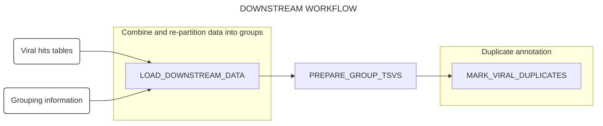
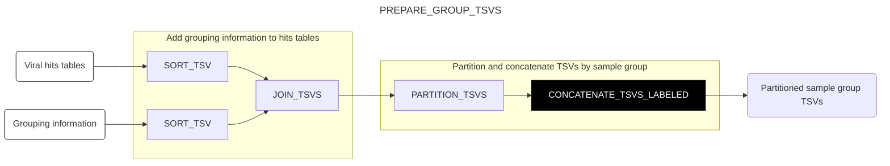

# DOWNSTREAM WORKFLOW

This page describes the structure and function of the `DOWNSTREAM` workflow. This workflow is responsible for downstream analysis of the outputs of the [`RUN` workflow](./run.md), particularly in cases that require comparisons across reads and/or samples[^comp]. Currently, this workflow only performs a single analysis, namely identification and marking of duplicate reads based on their Bowtie2 alignment results.

[^comp]: These are kept to a minimum in the `RUN` workflow to minimize memory demands and maximize parallelization.

## Workflow structure



## Subworkflows

### Load data into channels (`LOAD_DOWNSTREAM_DATA`)

This subworkflow takes in an input file specifying (1) paths to one or more viral hits tables produced by the `RUN`workflow, and (2) paths to corresponding TSV files specifying the sample groupings to be used for duplicate annotation (see [below](#usage) for more information on this input file). The subworkflow validates that this input file has the required structure, then extracts the filepaths into a channel with the structure expected by the rest of the workflow. (No diagram is provided for this subworkflow.)

### Partition into groups for duplicate annotation (`PREPARE_GROUP_TSVS`)

This subworkflow takes in the channel output by `LOAD_DOWNSTREAM_DATA`, adds sample grouping information to the viral hits tables, then partitions each viral hits table into a separate TSV per sample group. Partitions from different hits tables with matching group annotations are then concatenated together, enabling duplicate annotation across different pipeline runs (e.g. from different data deliveries) as specified by the user.



### Annotate alignment duplicates (`MARK_VIRAL_DUPLICATES`)

This subworkflow takes in partitioned hits tables from `PREPARE_GROUP_TSVS`, then identifies duplicate reads on the basis of their assigned genome ID and alignment coordinates, as determined by Bowtie2 in the `RUN` workflow. In order to be considered duplicates, two read pairs must be mapped to the same genome ID by Bowtie2[^gid], with terminal alignment coordinates that are within a user-specified distance of each other (default 1 nt) at both ends. This fuzzy matching allows for the identification of duplicate reads in the presence of small read errors, alignment errors or overzealous adapter trimming.

For each group of reads identified as duplicates, the algorithm selects the read pair with the highest average quality score to act as the "exemplar" of the group. Each read in the group is annotated with this examplar to identify its duplicate group[^exemplar], enabling downstream deduplication or other duplicate analyses if needed. In addition to an annotated hits TSV containing an additional column for exemplar IDs, the subworkflow also returns a summary TSV giving the number of reads mapped to a given exemplar ID, as well as the fraction of read pairs in the group that are pairwise duplicates[^pairwise].

[^exemplar]: A read with no duplicates will be annotated with itself as the exemplar.
[^pairwise]: Because of the fuzzy matching used to identify duplicates, it is possible for duplicate annotation to be intransitive: i.e. read A is a duplicate of read B, and read B is a duplicate of read C, but read A is not a duplicate of read C. As currently implemented, the algorithm will group a read into a duplicate group if it matches any single read already in that duplicate group, potentially leading to the grouping of reads that would not be considered duplicates of each other in isolation. The reporting of the pairwise duplicate statistic in the summary file allows for quantification of this phenomenon, and potential adjustment of parameters if too high a fraction of non-matching reads are being grouped together in this way.

```mermaid
---
title: MARK_VIRAL_DUPLICATES
config:
  layout: horizontal
---
flowchart LR
A(Partitioned sample group TSVs <br> (PREPARE_GROUP_TSVS)) --> B[MARK ALIGNMENT DUPLICATES]
B --> C[SORT_TSV]
B --> D[SORT_TSV]
C --> E(Annotated hits TSVs)
D --> F(Summary TSVs)
style A fill:#fff,stroke:#000
style E fill:#000,color:#fff,stroke:#000
style F fill:#000,color:#fff,stroke:#000
```
