# DOWNSTREAM WORKFLOW

This page describes the structure and function of the `DOWNSTREAM` workflow. This workflow is responsible for downstream analysis of the outputs of the [`RUN` workflow](./run.md), particularly in cases that require comparisons across reads and/or samples[^comp]. Currently, this workflow performs two main analyses: (1) identification and marking of duplicate reads based on their Bowtie2 alignment results, and (2) validation of viral taxonomic assignments using BLAST against the NCBI core_nt database.

[^comp]: These are kept to a minimum in the `RUN` workflow to minimize memory demands and maximize parallelization.

> [!NOTE]
> Currently, the `DOWNSTREAM` workflow is only used for short-read data. We intend to investigate similar workflows for ONT data in the future.


## Workflow structure

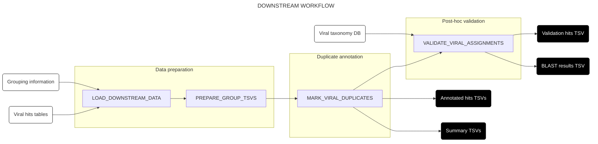

## Subworkflows

### Load data into channels (`LOAD_DOWNSTREAM_DATA`)

This subworkflow takes in an input file specifying (1) paths to one or more viral hits tables produced by the `RUN`workflow, and (2) paths to corresponding TSV files specifying the sample groupings to be used for duplicate annotation (see [below](#usage) for more information on this input file). The subworkflow validates that this input file has the required structure, then extracts the filepaths into a channel with the structure expected by the rest of the workflow. (No diagram is provided for this subworkflow.)

### Partition into groups for duplicate annotation (`PREPARE_GROUP_TSVS`)

This subworkflow takes in the channel output by `LOAD_DOWNSTREAM_DATA`, adds sample grouping information to the viral hits tables, then partitions each viral hits table into a separate TSV per sample group. Partitions from different hits tables with matching group annotations are then concatenated together, enabling duplicate annotation across different pipeline runs (e.g. from different data deliveries) as specified by the user.

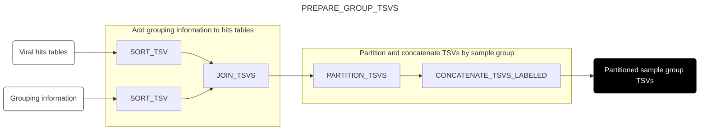

### Annotate alignment duplicates (`MARK_VIRAL_DUPLICATES`)

This subworkflow takes in partitioned hits tables from `PREPARE_GROUP_TSVS`, then identifies duplicate reads on the basis of their assigned genome ID and alignment coordinates, as determined by Bowtie2 in the `RUN` workflow. In order to be considered duplicates, two read pairs must be mapped to the same genome ID by Bowtie2, with terminal alignment coordinates that are within a user-specified distance of each other (default 1 nt) at both ends. This fuzzy matching allows for the identification of duplicate reads in the presence of small read errors, alignment errors or overzealous adapter trimming.

For each group of reads identified as duplicates, the algorithm selects the read pair with the highest average quality score to act as the "exemplar" of the group. Each read in the group is annotated with this examplar to identify its duplicate group[^exemplar], enabling downstream deduplication or other duplicate analyses if needed. In addition to an annotated hits TSV containing an additional column for exemplar IDs, the subworkflow also returns a summary TSV giving the number of reads mapped to a given exemplar ID, as well as the fraction of read pairs in the group that are pairwise duplicates[^pairwise].

[^exemplar]: A read with no duplicates will be annotated with itself as the exemplar.
[^pairwise]: Because of the fuzzy matching used to identify duplicates, it is possible for duplicate annotation to be intransitive: i.e. read A is a duplicate of read B, and read B is a duplicate of read C, but read A is not a duplicate of read C. As currently implemented, the algorithm will group a read into a duplicate group if it matches any single read already in that duplicate group, potentially leading to the grouping of reads that would not be considered duplicates of each other in isolation. The reporting of the pairwise duplicate statistic in the summary file allows for quantification of this phenomenon, and potential adjustment of parameters if too high a fraction of non-matching reads are being grouped together in this way.

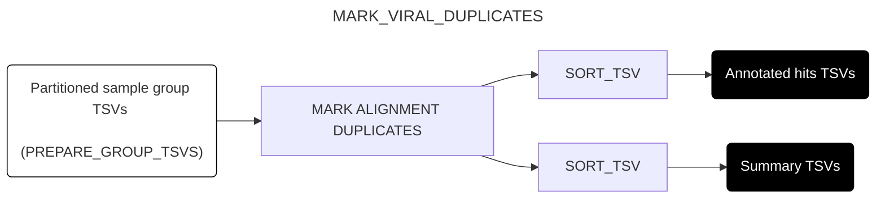

### Validate viral taxonomic assignments (`VALIDATE_VIRAL_ASSIGNMENTS`)

This subworkflow uses BLAST to validate the taxonomic assignments given to putative viral reads by the RUN workflow. Specifically, it:

- Takes in annotated hits TSVs from `MARK_VIRAL_DUPLICATES`
- Splits them by assigned taxid at the species level
- Clusters reads within each species using VSEARCH to identify cluster representatives
- Aligns cluster representatives against the NCBI core_nt database with BLAST
- Filters BLAST hits by bitscore and calculates the [lowest common ancestor (LCA)](https://en.wikipedia.org/wiki/Lowest_common_ancestor) of remaining hits
- Calculates the taxonomic distance between each BLAST LCA assignment and the corresponding raw assignment from the RUN workflow
- Propagates this information back from cluster representatives to other sequences in each cluster.

This is a complex analysis with a number of steps, which have been grouped into component subworkflows for comprehensibility. See the [appendix](./downstream.md#appendix-detailed-breakdown-of-post-hoc-validation-subworkflows) for more detailed information on each component.

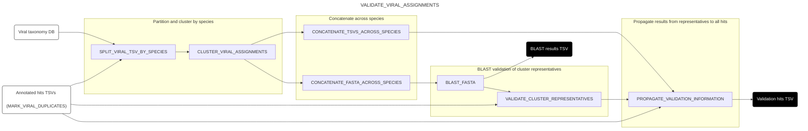

## Usage

> [!IMPORTANT]
> As with the [`RUN` workflow](./usage.md), before following the instructions in this section, make sure you have followed the [installation and setup instructions](./installation.md).

To run the `DOWNSTREAM` workflow, you need:

1. One or more accessible **viral hits tables** produced by the `RUN` workflow. These are [typically saved](./output.md#viral-identification)  in the `RUN` workflow's output directory under `results/virus_hits_final.tsv.gz`.
2. For each hit table, an accessible **grouping TSV**, containing the following columns in the specified order:
    - `sample`: Sample ID (must include one row for every value of this column in the viral hits table)
    - `group`: Group IDs to use for duplicate annotatation
3. An accessible **input file CSV** mapping viral hits tables to grouping TSVs, containing the following columns in the specified order:
    - `label`: Arbitrary string label to use for each viral hits table
    - `hits_tsv`: Path to the viral hits table
    - `groups_tsv`: Path to the corresponding grouping TSV
4. A **reference directory** containing the databases and indices generated by the [`INDEX` workflow](./index.md), including[^ref_dir]:
    - The viral taxonomy database (`total-virus-db-annotated.tsv.gz`)
    - The BLAST database for validation (e.g., `core_nt/`)
    - NCBI taxonomy files (`taxonomy-nodes.dmp`, `taxonomy-names.dmp`)
5. A **config file** in a clean launch directory, pointing to:
    - The pipeline mode (`params.mode = "downstream"`);
    - The input file (`params.input_file`);
    - The base directory in which to put the working and output directories (`params.base_dir`);
    - The reference directory containing databases and indices (`params.ref_dir`);
    - The permitted deviation when identifying alignment duplicates (`params.aln_dup_deviation`);
    - Parameters for sequence clustering during validation:
        - `params.validation_cluster_identity`: Minimum sequence identity for cluster formation (default 0.95)
        - `params.validation_n_clusters`: Maximum clusters per species to validate (default 20)
    - Parameters for BLAST validation:
        - `params.blast_db_prefix`: Prefix for BLAST database (e.g., "core_nt")
        - `params.blast_perc_id`: Percentage identity threshold for BLAST hits (default 60)
        - `params.blast_qcov_hsp_perc`: Query coverage threshold for BLAST hits (default 30)
        - `params.blast_max_rank`: Maximum rank for BLAST hits by bitscore (default 10)
        - `params.blast_min_frac`: Minimum fraction of best bitscore to retain hits (default 0.9)
        - `params.taxid_artificial`: Parent taxid for artificial sequences (default 81077)

> [!NOTE]
> Currently, the input file and grouping TSV must be generated manually. We intend to implement programmatic generation of these files in the future.

> [!TIP]
> We recommend starting each pipeline run in a clean launch directory, containing only your input file and config file.

Given these input files, you must choose a run profile as described [here](./usage.md#2-choosing-a-profile). You can then run the pipeline as follows:

```
nextflow run -resume -profile <PROFILE> <PATH/TO/PIPELINE/DIR>
```

where `<PATH/TO/PIPELINE/DIR>` specifies the path to the directory containing the pipeline files from this repository (in particular, `main.nf`) from the launch directory.

Once the pipeline has finished, output and logging files will be available in the `output` subdirectory of the base directory specified in the config file.

> [!IMPORTANT]
> As with the `RUN` workflow, it's highly recommended to clean up your Nextflow working directory after run completion. You can do this manually or with the `nextflow clean` command.

[^ref_dir]: This can be the same reference directory used by the `RUN` workflow - you do not need to run the `INDEX` workflow separately for the `DOWNSTREAM` workflow.

## Appendix: Detailed breakdown of post-hoc validation subworkflows


#### Split hits TSVs by assigned species (`SPLIT_VIRAL_TSV_BY_SPECIES`)

This subworkflow takes in viral hits TSVs from `MARK_VIRAL_DUPLICATES`, each of which is annotated by its read group as assigned by `PREPARE_GROUP_TSVS`. Each hits TSV is joined with the viral taxonomy DB generated by the INDEX workflow, then partitioned based on the species-level taxid corresponding to each read's assigned taxid. The result is a longer series of hits TSVs, each annotated with a combination of group and species.

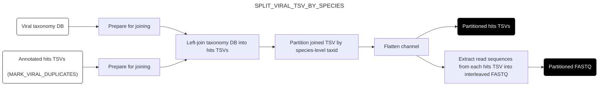

#### Cluster hits within species and obtain representative sequences (`CLUSTER_VIRAL_ASSIGNMENTS`)

This subworkflow takes in partitioned FASTQ sequences from `SPLIT_VIRAL_TSV_BY_SPECIES`, clusters them using [VSEARCH](https://github.com/torognes/vsearch), and returns representative sequences from the largest clusters, along with a TSV mapping each hit to its corresponding cluster representative. By clustering sequences within each species, the subworkflow reduces the computational cost of validation by selecting only representative sequences rather than validating every individual hit.

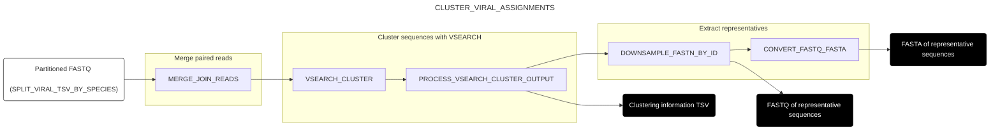

#### Concatenate data across species (`CONCATENATE_FASTA_ACROSS_SPECIES` and `CONCATENATE_TSVS_ACROSS_SPECIES`)

These two subworkflows take partitioned data from `CLUSTER_VIRAL_ASSIGNMENTS` (FASTA files and clustering TSVs respectively) and reorganize them by sample group rather than by species. Each subworkflow extracts the group identifier from the combined group/species labels, then concatenates all files sharing the same group label. This restructuring allows for group-level BLAST analysis rather than separate BLAST jobs for each species, significantly reducing computational overhead.

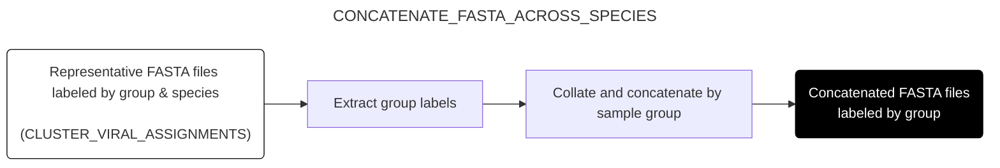

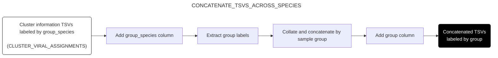

#### Perform BLAST validation (`BLAST_FASTA`)

This subworkflow takes concatenated representative sequences from `CONCATENATE_FASTA_ACROSS_SPECIES` and validates them against the NCBI core_nt database using BLAST. The subworkflow then filters BLAST results to retain only high-quality alignments: specifically, it filters to only the best alignment for each query/subject combination, then filters these to only include those whose bitscore is:

1. In the top-N alignments by bitscore for that query (for some N);
2. At least P% of the bitscore of the best alignment for that query (for some P).

After filtering, the subworkflow computes the lowest common ancestor (LCA) of the retained BLAST hits for each query sequence.

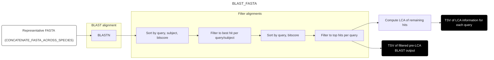

#### Compare original and BLAST assignments (`VALIDATE_CLUSTER_REPRESENTATIVES`)

This subworkflow takes the original viral hits from `MARK_VIRAL_DUPLICATES` and the LCA results from `BLAST_FASTA`; computes an inner-join on sequence ID to restrict the result to cluster representatives; then compares the initial taxonomic assignments with the LCA assignments from BLAST. The subworkflow computes the taxonomic distance between the original assignment and the BLAST-derived LCA by counting the steps from each taxid assignment to their lowest common ancestor, providing a quantitative measure of assignment accuracy.

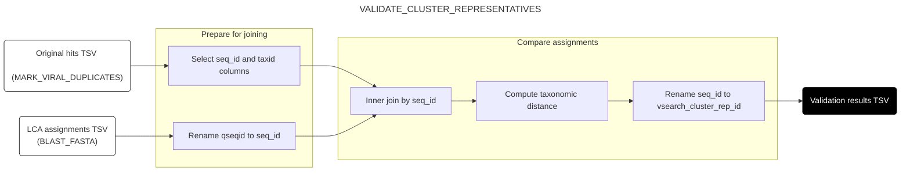

#### Propagate validation to individual hits (`PROPAGATE_VALIDATION_INFORMATION`)

This subworkflow takes three inputs: the original hits TSV, the clustering information TSV from `CONCATENATE_TSVS_ACROSS_SPECIES`, and the validation results from `VALIDATE_CLUSTER_REPRESENTATIVES`. Through a series of left-joins, it combines information from all of these into a single output TSV. The result is a TSV for which each hit is annotated with (a) its cluster representative status and ID, and (b) validation information for that representative, allowing indirect validation of each hit without BLASTing each of them individually.

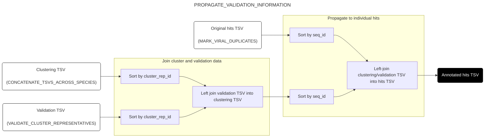