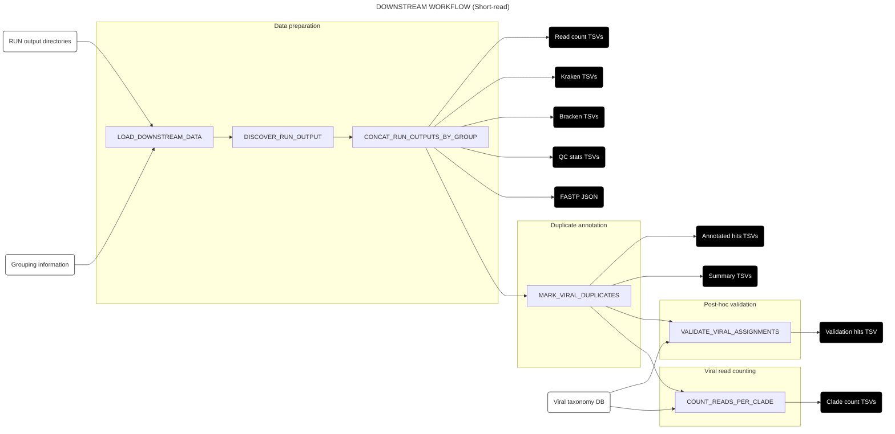
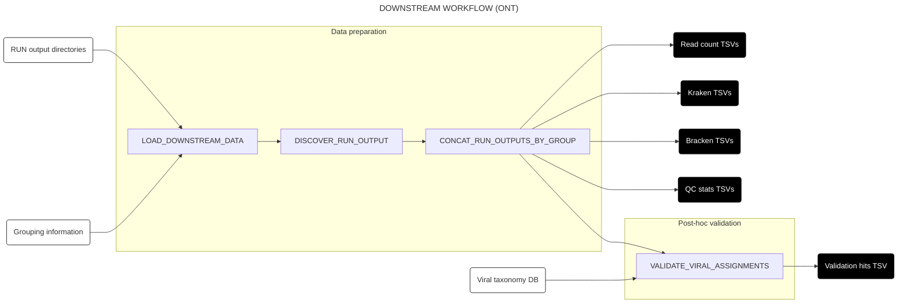
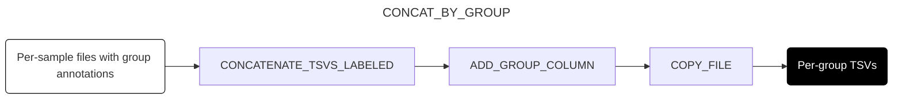
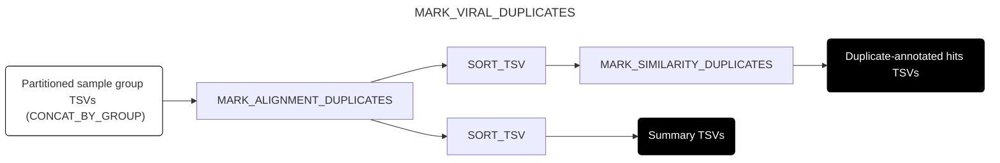
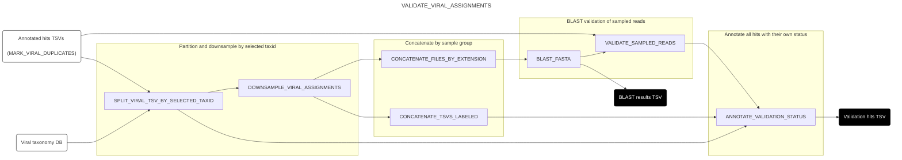
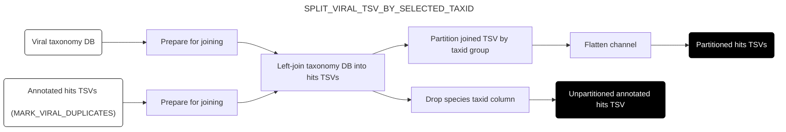
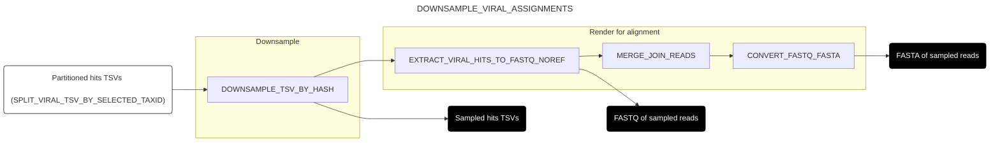
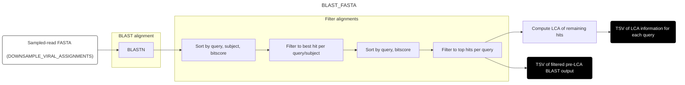
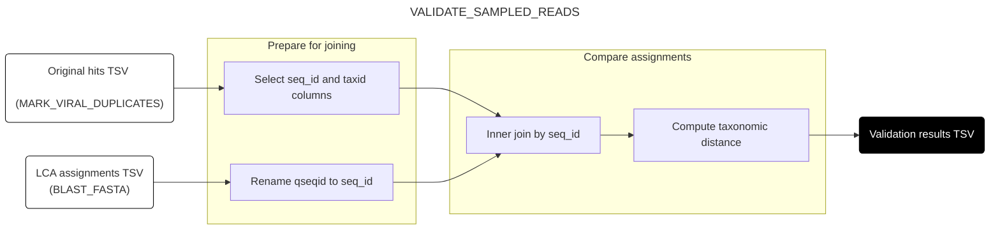
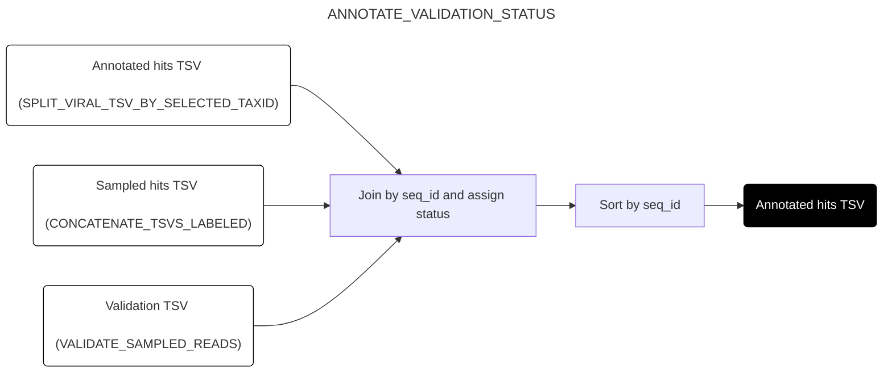

# DOWNSTREAM WORKFLOW

This page describes the structure and function of the `DOWNSTREAM` workflow. This workflow is responsible for downstream analysis of the outputs of the [`RUN` workflow](./run.md), particularly in cases that require comparisons across reads and/or samples[^comp].

For short-read data, this workflow performs three main analyses: (1) identification and marking of duplicate reads, first from their Bowtie2 alignment coordinates and then by sequence similarity among the reads that survive, (2) validation of viral taxonomic assignments using BLAST against the NCBI core_nt database, and (3) counting the number of reads assigned to viral clades by LCA.

For ONT data, the workflow only performs (1) validation of viral taxonomic assignments using BLAST against the NCBI core_nt database.

For detailed column-level documentation of DOWNSTREAM output files, see the [schema files](../schemas/) — each schema includes field names, types, descriptions, and examples.

[^comp]: These are kept to a minimum in the `RUN` workflow to minimize memory demands and maximize parallelization.

## Workflow structure

### Short-read (Illumina/Aviti)


```mermaid
---
title: DOWNSTREAM WORKFLOW (Short-read)
config:
  layout: horizontal
---
flowchart LR
A(RUN output directories) & B(Grouping information) --> C[LOAD_DOWNSTREAM_DATA]
C --> N[DISCOVER_RUN_OUTPUT]
N --> O[CONCAT_RUN_OUTPUTS_BY_GROUP]
O --> S(Read count TSVs)
O --> KR(Kraken TSVs)
O --> BR(Bracken TSVs)
O --> QC(QC stats TSVs)
O --> FJ(FASTP JSON)
O --> E[MARK_VIRAL_DUPLICATES]
E --> J(Annotated hits TSVs)
E --> K(Summary TSVs)
E --> F[VALIDATE_VIRAL_ASSIGNMENTS]
G(Viral taxonomy DB) --> F
F --> H(Validation hits TSV)
G --> L[COUNT_READS_PER_CLADE]
E --> L
L --> M(Clade count TSVs)
subgraph "Data preparation"
C
N
O
end
subgraph "Duplicate annotation"
E
end
subgraph "Post-hoc validation"
F
end
subgraph "Viral read counting"
L
end
style A fill:#fff,stroke:#000
style B fill:#fff,stroke:#000
style G fill:#fff,stroke:#000
style H fill:#000,color:#fff,stroke:#000
style J fill:#000,color:#fff,stroke:#000
style K fill:#000,color:#fff,stroke:#000
style M fill:#000,color:#fff,stroke:#000
style S fill:#000,color:#fff,stroke:#000
style KR fill:#000,color:#fff,stroke:#000
style BR fill:#000,color:#fff,stroke:#000
style QC fill:#000,color:#fff,stroke:#000
style FJ fill:#000,color:#fff,stroke:#000
```

### Long-read (ONT)


```mermaid
---
title: DOWNSTREAM WORKFLOW (ONT)
config:
  layout: horizontal
---
flowchart LR
A(RUN output directories) & B(Grouping information) --> C[LOAD_DOWNSTREAM_DATA]
C --> N[DISCOVER_RUN_OUTPUT]
N --> O[CONCAT_RUN_OUTPUTS_BY_GROUP]
O --> S(Read count TSVs)
O --> KR(Kraken TSVs)
O --> BR(Bracken TSVs)
O --> QC(QC stats TSVs)
O --> F[VALIDATE_VIRAL_ASSIGNMENTS]
G(Viral taxonomy DB) --> F
F --> H(Validation hits TSV)
subgraph "Data preparation"
C
N
O
end
subgraph "Post-hoc validation"
F
end
style A fill:#fff,stroke:#000
style B fill:#fff,stroke:#000
style G fill:#fff,stroke:#000
style H fill:#000,color:#fff,stroke:#000
style S fill:#000,color:#fff,stroke:#000
style KR fill:#000,color:#fff,stroke:#000
style BR fill:#000,color:#fff,stroke:#000
style QC fill:#000,color:#fff,stroke:#000
```

## Subworkflows

### Load data into channels (`LOAD_DOWNSTREAM_DATA`)

This subworkflow takes in an input file specifying (1) paths to one or more RUN results directories, and (2) paths to corresponding TSV files specifying the sample groupings to be used for duplicate annotation (see [below](#usage) for more information on this input file). The subworkflow validates that this input file has the required structure, resolves run results directory paths, and parses grouping TSVs into sample-group tuples. It emits `run_dirs` (unique resolved directory paths per label) and `groups` (label, sample, group tuples) for use by `DISCOVER_RUN_OUTPUT`. (No diagram is provided for this subworkflow.)

### Discover per-sample output files (`DISCOVER_RUN_OUTPUT`)

This is a reusable subworkflow that discovers all per-sample TSV and JSON files from the RUN output directories and matches them to sample groups. It takes `run_dirs` and `groups` from `LOAD_DOWNSTREAM_DATA`, reads the list of expected per-sample output suffixes from `pyproject.toml`, and for each sample and suffix constructs the expected file path and checks for its existence (trying both gzipped and plain variants). It then validates that all expected per-sample output files are present, failing with an informative error if any are missing (e.g. due to incomplete S3 copies). The output is a channel of tuples `(label, sample, file, group)` containing all discovered files. (No diagram is provided for this subworkflow.)

### Concatenate all per-sample RUN outputs by group (`CONCAT_RUN_OUTPUTS_BY_GROUP`)

This subworkflow wraps multiple calls to `CONCAT_BY_GROUP` (see below) to concatenate all per-sample RUN output types (viral hits, read counts, Kraken reports, Bracken abundance estimates, and QC statistics) into per-group TSVs, and calls `CONCAT_JSON_BY_GROUP` to merge per-sample FASTP JSON files into per-group JSON outputs. It emits three output channels: `hits` (used by downstream duplicate marking, validation, and clade counting), `fastp_json` (per-group combined FASTP QC data, short-read only), and `other` (all remaining TSV outputs, which flow directly to the published results).


### Concatenate per-sample outputs into per-group TSVs (`CONCAT_BY_GROUP`)

This is a general-purpose subworkflow that takes per-sample file tuples (with group annotations), filters for files matching a specified suffix, groups them by sample group, concatenates the files within each group, adds a group column, and renames the output to a clean filename. It is called by `CONCAT_RUN_OUTPUTS_BY_GROUP` for each RUN output type (viral hits, read counts, Kraken reports, Bracken abundance estimates, and QC statistics).


```mermaid
---
title: CONCAT_BY_GROUP
config:
  layout: horizontal
---
flowchart LR
A("Per-sample files with group annotations") --> B[CONCATENATE_TSVS_LABELED]
B --> C[ADD_GROUP_COLUMN]
C --> D[COPY_FILE]
D --> E("Per-group TSVs")
style A fill:#fff,stroke:#000
style E fill:#000,color:#fff,stroke:#000
```

### Annotate duplicates (`MARK_VIRAL_DUPLICATES`)

> [!NOTE]
> This subworkflow is only executed for short-read platforms. ONT processing skips this step.

This subworkflow takes in partitioned hits tables from `CONCAT_BY_GROUP`, then marks duplicates in two passes: by alignment coordinates, then by sequence similarity among the reads that survive.

**Alignment-based marking** identifies duplicate reads on the basis of their assigned genome ID and alignment coordinates, as determined by Bowtie2 in the `RUN` workflow. In order to be considered duplicates, two read pairs must be mapped to the same genome ID by Bowtie2, with terminal alignment coordinates that are within a user-specified distance of each other (default 1 nt) at both ends. A read pair with only one mate aligned is keyed on that mate's start coordinate and the strand it aligned to, so two such reads sharing a coordinate but not a strand are not duplicates. This fuzzy matching allows for the identification of duplicate reads in the presence of small read errors, alignment errors or overzealous adapter trimming.

For each group of reads identified as duplicates, the algorithm selects the read pair with the highest average quality score to act as the "exemplar" of the group. Each read in the group is annotated with this examplar in `prim_align_dup_exemplar` to identify its duplicate group[^exemplar], enabling downstream deduplication or other duplicate analyses if needed. In addition to an annotated hits TSV containing an additional column for exemplar IDs, the subworkflow also returns a summary TSV giving the number of reads mapped to a given exemplar ID, as well as the fraction of read pairs in the group that are pairwise duplicates[^pairwise].

**Similarity-based marking** then groups the alignment-unique reads by sequence similarity, using minimizer-based clustering via the [nao-dedup](https://github.com/securebio/nao-dedup) library. It adds `sim_dup_exemplar` and `sim_dup_group_size` (the number of reads that exemplar stands for, including its group members' alignment duplicates).

Both sets of columns are carried through validation into `{group}_validation_hits.tsv.gz`.

[^exemplar]: A read with no duplicates will be annotated with itself as the exemplar.
[^pairwise]: Because of the fuzzy matching used to identify duplicates, it is possible for duplicate annotation to be intransitive: i.e. read A is a duplicate of read B, and read B is a duplicate of read C, but read A is not a duplicate of read C. As currently implemented, the algorithm will group a read into a duplicate group if it matches any single read already in that duplicate group, potentially leading to the grouping of reads that would not be considered duplicates of each other in isolation. The reporting of the pairwise duplicate statistic in the summary file allows for quantification of this phenomenon, and potential adjustment of parameters if too high a fraction of non-matching reads are being grouped together in this way.


```mermaid
---
title: MARK_VIRAL_DUPLICATES
config:
  layout: horizontal
---
flowchart LR
A("Partitioned sample group TSVs <br> (CONCAT_BY_GROUP)") --> B[MARK_ALIGNMENT_DUPLICATES]
B --> C[SORT_TSV]
B --> D[SORT_TSV]
C --> E[MARK_SIMILARITY_DUPLICATES]
D --> F(Summary TSVs)
E --> G(Duplicate-annotated hits TSVs)
style A fill:#fff,stroke:#000
style F fill:#000,color:#fff,stroke:#000
style G fill:#000,color:#fff,stroke:#000
```

#### Read assignments after duplicate marking

Once duplicates are marked, each read can be thought of as having two assignments:

- The read's own aligner LCA, in `aligner_taxid_lca`, or
- The aligner LCA of the exemplar representing it.

Generally these two taxids agree. However, alignment-based marking keys on the aligner's primary genome ID and similarity-based marking on the read sequence itself, neither of which is directly tied to `aligner_taxid_lca`, which is derived from all of a read's alignments. A duplicate group can therefore span multiple `aligner_taxid_lca` values, or even multiple `selected_taxid` values, which means a read can be partitioned separately from its exemplar during validation. In the extreme, a `selected_taxid` partition can contain nothing but duplicate reads whose exemplars all fall in other partitions. That partition is then not validated at all: its reads' exemplars are eligible for validation where they landed, but nothing guarantees they are sampled.

### Validate viral taxonomic assignments (`VALIDATE_VIRAL_ASSIGNMENTS`)

This subworkflow uses BLAST to validate the taxonomic assignments given to putative viral reads by the RUN workflow. Specifically, it:

- Takes in annotated hits TSVs from `MARK_VIRAL_DUPLICATES`
- Splits the data by the assigned taxid at the species level if the LCA assignment is at or below that level; otherwise, splits by the raw LCA taxid. This result is the taxid group, recorded in the output as `selected_taxid`.
- Downsamples each taxid group to at most `params.validation_n_sample` reads, drawing only from reads that survived both duplicate-marking passes (`seq_id == sim_dup_exemplar`), since a read that duplicates another adds no evidence about its species. ONT skips duplicate marking, so every read stays eligible there. This has a consequence for taxa whose duplicate groups span more than one assignment, described in [Read assignments after duplicate marking](#read-assignments-after-duplicate-marking).
- Aligns the retained reads against the NCBI core_nt database with BLAST
- Filters BLAST hits by bitscore and calculates the [lowest common ancestor (LCA)](https://en.wikipedia.org/wiki/Lowest_common_ancestor) of remaining hits
- Calculates the taxonomic distance between each BLAST LCA assignment and the corresponding raw assignment from the RUN workflow
- Annotates every hit with its own validation result and a `validation_status` column.

Each read's `validation_*` columns describe that read's own BLAST alignments, or are NA. The `validation_status` column records which case applies:

| `validation_status` | Meaning |
| --- | --- |
| `aligned` | The read was selected for validation and BLAST returned at least one hit passing the score filters. |
| `no_alignment` | The read was selected for validation, but no hit survived filtering. The `validation_*` columns are NA. |
| `not_sampled` | The read was not selected for validation. The `validation_*` columns are NA. |

This is a complex analysis with a number of steps, which have been grouped into component subworkflows for comprehensibility. See the [appendix](./downstream.md#appendix-detailed-breakdown-of-post-hoc-validation-subworkflows) for more detailed information on each component.


```mermaid
---
title: VALIDATE_VIRAL_ASSIGNMENTS
config:
  layout: horizontal
---
flowchart LR
C("Viral taxonomy DB") --> B[SPLIT_VIRAL_TSV_BY_SELECTED_TAXID]
A("Annotated hits TSVs <br> (MARK_VIRAL_DUPLICATES)") --> B
B --> D[DOWNSAMPLE_VIRAL_ASSIGNMENTS]
D --> E[CONCATENATE_FILES_BY_EXTENSION]
D --> S[CONCATENATE_TSVS_LABELED]
E --> G[BLAST_FASTA]
G --> H[VALIDATE_SAMPLED_READS]
A --> H
B --> I[ANNOTATE_VALIDATION_STATUS]
S --> I
H --> I
I --> J(Validation hits TSV)
G --> K(BLAST results TSV)
subgraph "Partition and downsample by selected taxid"
B
D
end
subgraph "Concatenate by sample group"
E
S
end
subgraph "BLAST validation of sampled reads"
G
H
end
subgraph "Annotate all hits with their own status"
I
end
style A fill:#fff,stroke:#000
style C fill:#fff,stroke:#000
style J fill:#000,color:#fff,stroke:#000
style K fill:#000,color:#fff,stroke:#000
```

### Viral read counting


> [!NOTE]
> This subworkflow is only executed for short-read platforms. ONT processing skips this step.


For each sample group, this module counts the number of reads assigned by LCA to each viral taxon in two ways:

1. The number of reads directly assigned to a taxid by LCA.
2. The number of reads assigned to any taxid in the clade descended from a taxid by LCA.

It takes as input:

- Annotated hits TSVs from `MARK_VIRAL_DUPLICATES`
- The viral taxonomy database (`total-virus-db-annotated.tsv.gz`) generated by the [`INDEX` workflow](./index.md).

It outputs a TSV for each sample group (`<group>_clade_counts.tsv.gz`) with nine columns:

1. `group`: the sample group these counts are for
2. `taxid`: the taxid for the row
3. `parent_taxid`: the taxid of the row taxid's phylogenetic parent
4. `reads_direct_total`: the number of reads directly assigned to the taxid without deduplication
5. `reads_direct_dedup`: the number of reads directly assigned with deduplication, which excludes duplicates found by either marking pass (`seq_id == sim_dup_exemplar`)
6. `reads_direct_total_by_exemplar`: as `reads_direct_total`, but counting each read under the taxid of the exemplar representing it rather than its own
7. `reads_clade_total`: the number of reads assigned to the clade descended from the taxid (including the directly assigned reads) without deduplication
8. `reads_clade_dedup`: the number of reads assigned to the clade with deduplication
9. `reads_clade_total_by_exemplar`: as `reads_clade_total`, but counting each read under the taxid of the exemplar representing it

The `total` columns count each read under its own aligner LCA; the `total_by_exemplar` columns count it under the LCA of the exemplar representing it (see [Read assignments after duplicate marking](#read-assignments-after-duplicate-marking)). The two therefore differ only where a duplicate group's members were assigned different taxa. The `total_by_exemplar` columns exist so that `dedup / total_by_exemplar` is a per-taxid duplication rate over one coherent set of reads, which `dedup / total` is not.

## Usage

> [!IMPORTANT]
> As with the [`RUN` workflow](./usage.md), before following the instructions in this section, make sure you have followed the [installation and setup instructions](./installation.md).

To run the `DOWNSTREAM` workflow, you need:

1. One or more accessible **RUN results directories** produced by the `RUN` workflow, containing per-sample viral hits files (e.g. `*_virus_hits.tsv.gz`). These are [typically saved](./output.md#viral-identification) in the `RUN` workflow's output directory under `results/`.
2. For each RUN results directory, an accessible **grouping TSV**, containing the following columns in the specified order:
    - `sample`: Sample ID (must include one row for every value of this column in the viral hits table)
    - `group`: Group IDs to use for grouping samples in downstream analysis
3. An accessible **input file CSV** mapping RUN results directories to grouping TSVs, containing the following columns in the specified order:
    - `label`: Arbitrary string label to use for each RUN results directory
    - `run_results_dir`: Path to the RUN results directory containing per-sample viral hits files
    - `groups_tsv`: Path to the corresponding grouping TSV

> [!NOTE]
> Paths in the input file can be absolute paths, S3 URIs (e.g., `s3://bucket/path/to/file.tsv`), or **relative paths**. Relative paths are resolved against `params.input_base_dir`, which defaults to the pipeline directory (`projectDir`). To resolve relative paths against your launch directory instead, set `params.input_base_dir = launchDir` in your config file.

4. A **reference directory** containing the databases and indices generated by the [`INDEX` workflow](./index.md), including[^ref_dir]:
    - The viral taxonomy database (`total-virus-db-annotated.tsv.gz`)
    - The BLAST database for validation (published under a constant `blast_db/` directory regardless of which database was downloaded)
    - NCBI taxonomy files (`taxonomy-nodes.dmp`, `taxonomy-names.dmp`)
5. A **config file** in a clean launch directory, pointing to:
    - The sequencing platform (`params.platform`); one of: "illumina", "aviti", "pacbio", "ont"
    - The pipeline mode (`params.mode = "downstream"`);
    - The input file (`params.input_file`);
    - The base directory in which to put the working and output directories (`params.base_dir`);
    - The reference directory containing databases and indices (`params.ref_dir`);
    - The permitted deviation when identifying alignment duplicates (`params.aln_dup_deviation`); **Note: Only used for short-read platforms**
    - Parameter for downsampling during validation:
        - `params.validation_n_sample`: Maximum reads per selected taxid to validate (default 20 for non-ONT platforms, 1000000 for ONT[^max_sample]).
    - Parameters for BLAST validation:
        - INDEX always publishes the BLAST database to `results/blast_db/`; the originally downloaded database is recorded via the index's `params.blast_db_name`
        - `params.blast_perc_id`: Percentage identity threshold for BLAST hits (default 60 for short-read, 0 for long-read)
        - `params.blast_qcov_hsp_perc`: Query coverage threshold for BLAST hits (30 for short-read, 0 for long-read)
        - `params.blast_max_rank`: Maximum rank for BLAST hits by bitscore (10 for short-read, 5 for long-read)
        - `params.blast_min_frac`: Minimum fraction of best bitscore to retain hits (default 0.9)
        - `params.taxid_artificial`: Parent taxid for artificial sequences (default 81077)

[^max_sample]: The ONT default is set far above any realistic per-taxid viral read count, so in practice every read is validated. ONT libraries yield far fewer viral reads than short-read ones, so there is no need to subsample them.

> [!NOTE]
> Currently, the input file and grouping TSV must be generated manually. We intend to implement programmatic generation of these files in the future.

> [!TIP]
> We recommend starting each pipeline run in a clean launch directory, containing only your input file and config file.

> [!TIP]
> For ONT data, use `configs/downstream_ont.config` as your starting template, which includes downsampling and BLAST validation parameters more appropriate for ONT data.


Given these input files, you must choose a run profile as described [here](./usage.md#2-choosing-a-profile). You can then run the pipeline as follows:

```
nextflow run -resume -profile <PROFILE> <PATH/TO/PIPELINE/DIR>
```

where `<PATH/TO/PIPELINE/DIR>` specifies the path to the directory containing the pipeline files from this repository (in particular, `main.nf`) from the launch directory.

Once the pipeline has finished, output and logging files will be available in the `output` subdirectory of the base directory specified in the config file.

> [!IMPORTANT]
> As with the `RUN` workflow, it's highly recommended to clean up your Nextflow working directory after run completion. You can do this manually or with the `nextflow clean` command.

[^ref_dir]: This can be the same reference directory used by the `RUN` workflow - you do not need to run the `INDEX` workflow separately for the `DOWNSTREAM` workflow.

## Appendix: Detailed breakdown of post-hoc validation subworkflows


#### Split hits TSVs by taxid group (`SPLIT_VIRAL_TSV_BY_SELECTED_TAXID`)

This subworkflow takes in viral hits TSVs from `MARK_VIRAL_DUPLICATES`, each of which is annotated by its sample group as assigned by `CONCAT_BY_GROUP`. Each hits TSV is joined with the viral taxonomy DB generated by the INDEX workflow, then partitioned into taxid groups using the following rule: if a read's LCA assignment is at the species level or lower, group it by the species level taxid; otherwise, group the read by the raw LCA taxid. The result is a longer series of hits TSVs, each annotated with a combination of sample group and taxid group. The unpartitioned joined table is also emitted, for consumers that need every read rather than the per-taxid-group partitions; it carries the `selected_taxid` column assigned by the rule above, and drops the intermediate `taxid_species` column that computing it required.


```mermaid
---
title: SPLIT_VIRAL_TSV_BY_SELECTED_TAXID
config:
  layout: horizontal
---
flowchart LR
A("Viral taxonomy DB") --> B[Prepare for joining]
C("Annotated hits TSVs <br> (MARK_VIRAL_DUPLICATES)") --> D[Prepare for joining]
B --> E[Left-join taxonomy DB into hits TSVs]
D --> E
E --> F[Partition joined TSV by taxid group]
F --> G[Flatten channel]
E --> K[Drop species taxid column]
K --> L(Unpartitioned annotated hits TSV)
G --> H(Partitioned hits TSVs)
style A fill:#fff,stroke:#000
style C fill:#fff,stroke:#000
style H fill:#000,color:#fff,stroke:#000
style L fill:#000,color:#fff,stroke:#000
```

> [!NOTE]
> This subworkflow no longer extracts read sequences into FASTQ. Extraction happens in `DOWNSAMPLE_VIRAL_ASSIGNMENTS`, after downsampling, so only the reads actually being validated are ever converted.

#### Downsample hits within each taxid group (`DOWNSAMPLE_VIRAL_ASSIGNMENTS`)

This subworkflow takes the partitioned hits TSVs from `SPLIT_VIRAL_TSV_BY_SELECTED_TAXID` and reduces each taxid group to at most `params.validation_n_sample` reads, then renders the retained reads as FASTA ready for BLAST. Reads are selected by hashing `seq_id` and keeping the smallest N hashes.


```mermaid
---
title: DOWNSAMPLE_VIRAL_ASSIGNMENTS
config:
  layout: horizontal
---
flowchart LR
A("Partitioned hits TSVs <br> (SPLIT_VIRAL_TSV_BY_SELECTED_TAXID)") --> B[DOWNSAMPLE_TSV_BY_HASH]
B --> C[EXTRACT_VIRAL_HITS_TO_FASTQ_NOREF]
C --> D[MERGE_JOIN_READS]
D --> E[CONVERT_FASTQ_FASTA]
B --> H(Sampled hits TSVs)
C --> I(FASTQ of sampled reads)
E --> G(FASTA of sampled reads)
subgraph "Downsample"
B
end
subgraph "Render for alignment"
C
D
E
end
style A fill:#fff,stroke:#000
style G fill:#000,color:#fff,stroke:#000
style H fill:#000,color:#fff,stroke:#000
style I fill:#000,color:#fff,stroke:#000
```

#### Perform BLAST validation (`BLAST_FASTA`)

This subworkflow takes the concatenated sampled sequences from `DOWNSAMPLE_VIRAL_ASSIGNMENTS` (concatenated by sample group using `CONCATENATE_FILES_BY_EXTENSION`) and validates them against the NCBI core_nt database using BLAST. The subworkflow then filters BLAST results to retain only high-quality alignments: specifically, it filters to only the best alignment for each query/subject combination, then filters these to only include those whose bitscore is:

1. In the top-N alignments by bitscore for that query (for some N);
2. At least P% of the bitscore of the best alignment for that query (for some P).

After filtering, the subworkflow computes the lowest common ancestor (LCA) of the retained BLAST hits for each query sequence.


```mermaid
---
title: BLAST_FASTA
config:
  layout: horizontal
---
flowchart LR
A("Sampled-read FASTA <br> (DOWNSAMPLE_VIRAL_ASSIGNMENTS)") --> B[BLASTN]
B --> C[Sort by query, subject, bitscore]
C --> D[Filter to best hit per query/subject]
D --> E[Sort by query, bitscore]
E --> F[Filter to top hits per query]
F --> G[Compute LCA of remaining hits]
G --> H(TSV of LCA information for each query)
F --> I(TSV of filtered pre-LCA BLAST output)
subgraph "BLAST alignment"
B
end
subgraph "Filter alignments"
C
D
E
F
end
style A fill:#fff,stroke:#000
style H fill:#000,color:#fff,stroke:#000
style I fill:#000,color:#fff,stroke:#000
```

#### Compare original and BLAST assignments (`VALIDATE_SAMPLED_READS`)

This subworkflow takes the original viral hits from `MARK_VIRAL_DUPLICATES` and the LCA results from `BLAST_FASTA`; computes an inner join on sequence ID to restrict the result to those sampled reads that produced at least one surviving alignment; then compares the initial taxonomic assignments with the LCA assignments from BLAST. The subworkflow computes the taxonomic distance between the original assignment and the BLAST-derived LCA by counting the steps from each taxid assignment to their lowest common ancestor, providing a quantitative measure of assignment accuracy.


```mermaid
---
title: VALIDATE_SAMPLED_READS
config:
  layout: horizontal
---
flowchart LR
A("Original hits TSV <br> (MARK_VIRAL_DUPLICATES)") --> B[Select seq_id and taxid columns]
C("LCA assignments TSV <br> (BLAST_FASTA)") --> D[Rename qseqid to seq_id]
B --> E[Inner join by seq_id]
D --> E
E --> F[Compute taxonomic distance]
F --> H(Validation results TSV)
subgraph "Prepare for joining"
B
D
end
subgraph "Compare assignments"
E
F
end
style A fill:#fff,stroke:#000
style C fill:#fff,stroke:#000
style H fill:#000,color:#fff,stroke:#000
```

#### Annotate all hits with their validation status (`ANNOTATE_VALIDATION_STATUS`)

This process takes the annotated hits TSV from `SPLIT_VIRAL_TSV_BY_SELECTED_TAXID`, the concatenated sampled hits TSV, and the validation results from `VALIDATE_SAMPLED_READS`. It joins the validation results onto the hits table by `seq_id` and appends a `validation_status` column recording whether each read was `aligned`, produced `no_alignment`, or was `not_sampled`. Reads that were not aligned receive NA in every `validation_*` column.


```mermaid
---
title: ANNOTATE_VALIDATION_STATUS
config:
  layout: horizontal
---
flowchart LR
A("Annotated hits TSV <br> (SPLIT_VIRAL_TSV_BY_SELECTED_TAXID)") --> I[Join by seq_id and assign status]
B("Sampled hits TSV <br> (CONCATENATE_TSVS_LABELED)") --> I
C("Validation TSV <br> (VALIDATE_SAMPLED_READS)") --> I
I --> D[Sort by seq_id]
D --> J(Annotated hits TSV)
style A fill:#fff,stroke:#000
style B fill:#fff,stroke:#000
style C fill:#fff,stroke:#000
style J fill:#000,color:#fff,stroke:#000
```
