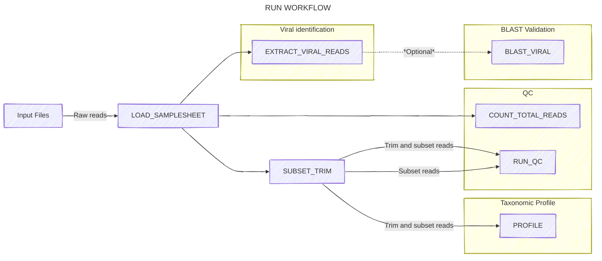
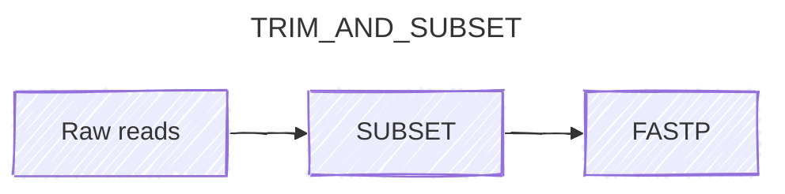
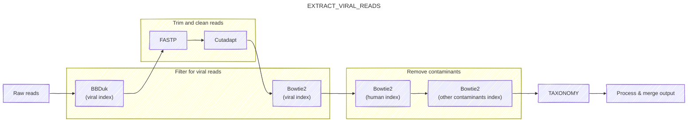
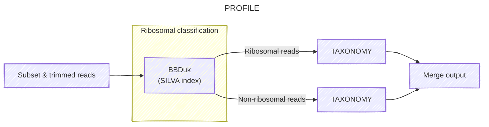
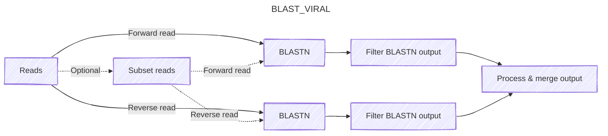
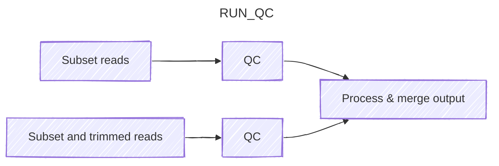
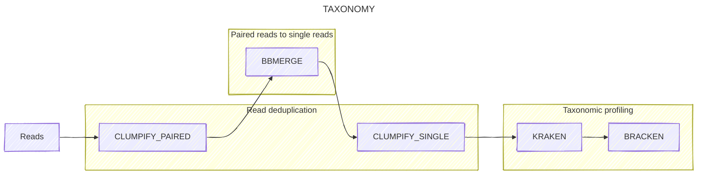
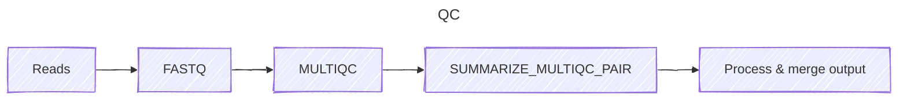

# RUN WORKFLOW

The `run` workflow is responsible for the primary analysis of the pipeline. 

By default, we define the host-infecting viruses to be screened against all vertebrate-infecting viruses and we don't perform BLAST validation. Corresponding config file: `configs/run.config`.

I've broken down the `run` workflow into a series of subworkflows, each of which performs a specific task:
1. [Setup workflows](#setup-workflows): Prepare the input data for analysis
    - [Load data into channels (LOAD_SAMPLESHEET)](#load-data-into-channels-load_samplesheet)
    - [Subset and trim reads (SUBSET_TRIM)](#subset-and-trim-reads-subset_trim)
2. [Analysis workflows](#analysis-workflows): Perform the primary analysis
    - [Viral identification phase (EXTRACT_VIRAL_READS)](#viral-identification-phase-extract_viral_reads)
    - [Taxonomic profiling phase (PROFILE)](#taxonomic-profiling-phase-profile)
    - [BLAST validation phase (BLAST_VIRAL)](#blast-validation-phase-blast_viral)
3. [QC workflows](#qc-workflows): Conduct quality control on the analysis results
    - [Count total reads (COUNT_TOTAL_READS)](#count-total-reads-count_total_reads)
    - [QC and output phase (RUN_QC)](#qc-and-output-phase-run_qc)
4. [Helper workflows](#helper-workflows): Helper workflows that are used by the workflows above
    - [Taxonomic assignment (TAXONOMY)](#taxonomic-assignment-taxonomy)
    - [QC (QC)](#qc-qc)

## Setup workflows

### Load data into channels (LOAD_SAMPLESHEET)
This workflow loads the samplesheet and creates a channel containing the samplesheet data. It also creates a channel containing the group data, which is used to group reads into samples. No diagram is provided for this workflow, as it's a simple channel creation workflow.

### Subset and trim reads (SUBSET_TRIM)
This workflow subsets the reads to a target number (default 1M/sample), and trims adapters with [FASTP](https://github.com/OpenGene/fastp), which both screens for adapters and trims low-quality and low-complexity sequences.

1. Subset reads using [Seqtk](https://github.com/lh3/seqtk)
2. Trim reads using [FASTP](https://github.com/OpenGene/fastp)

## Analysis workflows

### Viral identification phase (EXTRACT_VIRAL_READS)

The goal of this phase is to sensitively, specifically, and efficiently identify reads arising from host-infecting viruses. It uses a multi-step process designed to keep computational costs low while minimizing false-positive and false-negative errors.

1. To begin with, the raw reads are screened against a database of vertebrate-infecting viral genomes generated from Genbank by the index workflow. This initial screen is performed using [BBDuk](https://jgi.doe.gov/data-and-tools/software-tools/bbtools/bb-tools-user-guide/bbduk-guide/), which flags any read that contains at least three 21-mers matching any host-infecting viral genome. The purpose of this initial screen is to rapidly and sensitively identify putative vertebrate-infecting viral reads while discarding the vast majority of non-HV reads, reducing the cost associated with the rest of this phase.
2. Surviving reads undergo additional adapter trimming with [FASTP](https://github.com/OpenGene/fastp) and [Cutadapt](https://cutadapt.readthedocs.io/en/stable/) to remove any residual adapter contamination that might lead to false positive results.
3. Next, reads are aligned to the previously-mentioned database of vertebrate-infecting viral genomes with [Bowtie2](https://bowtie-bio.sourceforge.net/bowtie2/index.shtml) using quite permissive parameters designed to capture as many putative HV reads as possible. The SAM and FASTQ files are processed to generate new read files containing any read pair for which at least one read matches the HV database.
4. The output of the previous step is passed to a further filtering step, in which reads matching a series of common contaminant sequences are removed. This is done by aligning surviving reads to these contaminants using Bowtie2 in series[^filter]. Contaminants to be screened against include reference genomes from human, cow, pig, carp, mouse and *E. coli*, as well as various genetic engineering vectors.
5. Surviving read pairs are then taxonomically profiled using the [TAXONOMY workflow](#taxonomic-assignment-taxonomy), which deduplicates, merges and profiles the reads.
6.  Finally, reads are assigned a final vertebrate-infecting virus status if they:
    - Are classified as vertebrate-infecting virus by both Bowtie2 and Kraken2; or
    - Are unassigned by Kraken and align to an vertebrate-infecting virus taxon with Bowtie2 with an alignment score above a user-specifed threshold[^threshold].

[^filter]: We've found in past investigations that the two aligners detect different contaminant sequences, and aligning against both is more effective at avoiding false positives than either in isolation.
 
[^threshold]: Specifically, Kraken-unassigned read pairs are classed as HV if, for either read in the pair, S/ln(L) >= T, where S is the best-match Bowtie2 alignment score for that read, L is the length of the read, and T is the value of `params.bt2_score_threshold` specified in the config file.

### Taxonomic profiling phase (PROFILE)

The goal of this phase is to give an overview of the taxonomic composition of the cleaned reads from the preprocessing phase. In particular, it gives an estimate of (i) the fraction of ribosomal reads in the dataset, (ii) the taxonomic breakdown of the dataset at the domain level[^eukarya], and (iii) more detailed abundance estimates for lower-level taxa.

1. These subset reads are then separated into ribosomal and non-ribosomal read groups using BBDuk, by searching for ribosomal k-mers from the SILVA database obtained during the index workflow. 
2. The output of the previous step is passed to the [TAXONOMY workflow](#taxonomic-assignment-taxonomy), which returns back the Kraken2 and Bracken outputs.

[^eukarya]: As human is the only eukaryotic genome included in the Standard reference database for Kraken2, all sequences assigned to that domain can be assigned to *Homo sapiens*.

### *Optional: BLAST validation phase (BLAST_VIRAL)*

To evaluate the performance of the process described in the viral identification phase, it's useful to get some ground-truth information about whether the host viral assignments made in that subworkflow are correct. To do this, we use [BLASTN](https://blast.ncbi.nlm.nih.gov/Blast.cgi) to align the putative host viral reads output by the previous phase against the `core_nt` database, then process the output to check whether each sequence had a high-scoring alignment to at least one HV sequence. For computational tractability, this can be performed on only a subset of surviving host viral reads (specified by `params.blast_hv_fraction`)[^blast].

1. Reads are subset if `params.blast_hv_fraction` is less than 1, else if `params.blast_hv_fraction` is 1, then BLAST is run on all host viral reads.
2. Forward and reverse reads are aligned separately with BLASTN.
3. BLASTN outputs are filtered to keep only the best-scoring alignment for each read.
4. Output from both reads are combined into a single file, with columns for the read ID, the subject taxid, and the alignment score.

[^blast]: Setting `params.blast_hv_fraction` to 0 skips this step altogether.

## QC workflows

### Count total reads (COUNT_TOTAL_READS)
This phase counts the total number of reads in the input files, then merges them all into one file. No diagram is provided for this workflow, as it's a simple channel creation workflow.

### QC and output phase (RUN_QC)
This phase conducts quality control on the subsetted reads, both the raw and cleaned reads.

In this phase, the raw and cleaned reads from the preprocessing phase are analyzed with [FASTQC](https://www.bioinformatics.babraham.ac.uk/projects/fastqc/) and [MultiQC](https://multiqc.info/). This allows us to assess important metrics (e.g. read quality, read numbers, adapter content) in the raw input, and how these metrics are affected by cleaning. Relevant metrics are then extracted from MultiQC outputs into easy-to-parse TSV files[^tsvs] for downstream processing.

[^tsvs]: Specifically, `qc_basic_stats.tsv.gz`, `qc_adapter_stats.tsv.gz`, `qc_quality_base_stats.tsv.gz` and `qc_quality_sequence_stats.tsv.gz`.

## Helper workflows

### Taxonomic assignment (TAXONOMY)

This workflow performs taxonomic assignment on a set of reads.

1. Reads are deduplicated with [Clumpify](https://jgi.doe.gov/data-and-tools/software-tools/bbtools/bb-tools-user-guide/clumpify-guide/)[^dedup] 
2. Merged into single sequences through a combination of [BBMerge](https://jgi.doe.gov/data-and-tools/software-tools/bbtools/bb-tools-user-guide/bbmerge-guide/)[^merge]. Read pairs that fail to merge with BBMerge are concatenated end-to-end with an intervening "N" base.
3. Reads are deduplicated once again with Clumpify, but this time they're single end reads.
4. Reads are passed to [Kraken2](https://ccb.jhu.edu/software/kraken2/) for taxonomic assignment, using the reference database obtained in the index workflow. We record whether each read was (1) assigned to a host-infecting virus taxon with Kraken, (2) assigned to a non-HV taxon with Kraken, or (3) not assigned to any taxon. All reads in category (2) are filtered out.

[^dedup]: Which identifies and collapses groups of reads that are identical modulo some specified error rate.
[^merge]: Which aligns and merges read pairs with significant overlap.

### QC (QC)
This phase conducts quality control on any set of reads.

1. Run FASTQC on each pair of read files
2. Extract data with MultiQC for each pair of read files
3. Summarize MultiQC information for each pair of read files
4. Process and merge outputs