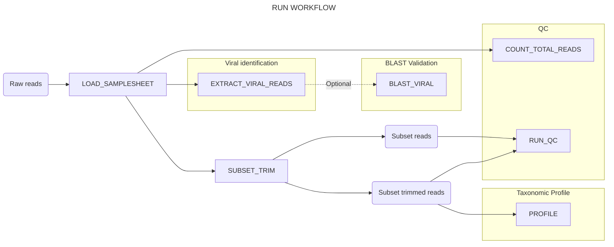
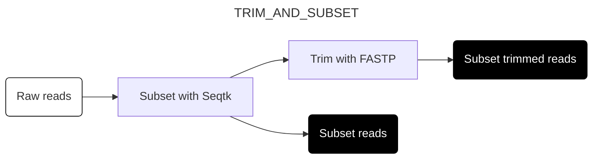
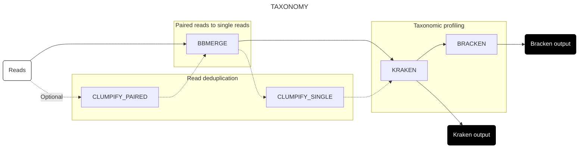
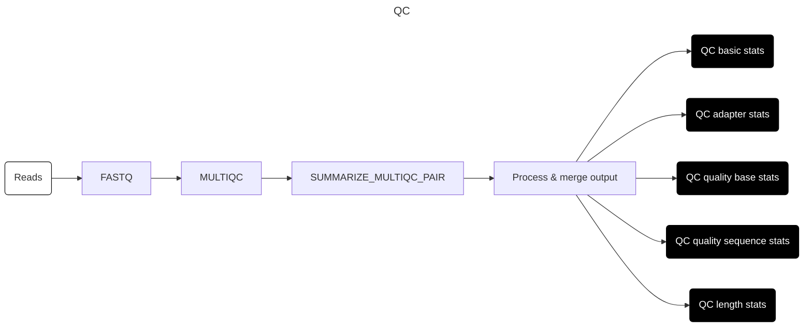
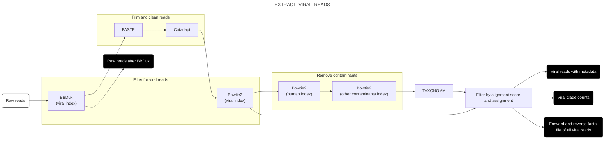
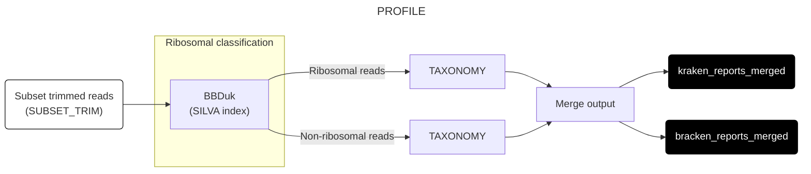
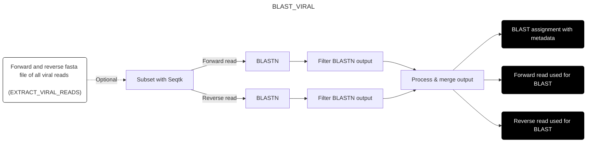

# RUN WORKFLOW

This page describes the structure and function of the `run` workflow, which is responsible for the primary analysis of the pipeline. For usage instructions, see [here](./docs/usage.md).

## Workflow structure

At a high level, the `run` workflow carries out two main analyses on raw input reads: sensitive and specific identification of vertebrate-infecting viral reads, and high-level taxonomic profiling. Optionally, it can also perform BLAST validation on putative vertebrate-infecting viral reads; however, this is slow and expensive and not performed by default.

To perform these functions, the workflow runs a series of subworkflows responsible for different tasks:

1. [Setup subworkflows](#setup-subworkflows): Prepare the input data for analysis
    - [Load data into channels (LOAD_SAMPLESHEET)](#load-data-into-channels-load_samplesheet)
    - [Subset and trim reads (SUBSET_TRIM)](#subset-and-trim-reads-subset_trim)
2. [Helper subworkflows](#helper-subworkflows): Helper workflows that are used by other subworkflows in this list
    - [Taxonomic assignment (TAXONOMY)](#taxonomic-assignment-taxonomy)
    - [QC (QC)](#qc-qc)
3. [Analysis subworkflows](#analysis-subworkflows): Perform the primary analysis
    - [Viral identification (EXTRACT_VIRAL_READS)](#viral-identification-extract_viral_reads)
    - [Taxonomic profiling (PROFILE)](#taxonomic-profiling-profile)
    - [BLAST validation (BLAST_VIRAL)](#blast-validation-blast_viral)
4. [QC subworkflows](#qc-subworkflows): Conduct quality control on the analysis results
    - [Count total reads (COUNT_TOTAL_READS)](#count-total-reads-count_total_reads)
    - [QC and output (RUN_QC)](#qc-and-output-run_qc)

## Setup subworkflows

### Load data into channels (LOAD_SAMPLESHEET)
This subworkflow loads the samplesheet and creates a channel containing the samplesheet data, in the structure expected by the pipeline. If provided, it also creates a channel containing the grouping information used to combine samples for downstream analysis. (No diagram is provided for this subworkflow.)

### Subset and trim reads (SUBSET_TRIM)
This subworkflow uses [Seqtk](https://github.com/lh3/seqtk) to randomly subsample the input reads to a target number[^target] (default 1 million read pairs per sample) to save time and and compute on downstream steps while still providing a reliable statistical picture of the overall sample. Following downsampling, reads undergo adapter trimming and quality screening with [FASTP](https://github.com/OpenGene/fastp), which both screens for adapters and trims low-quality and low-complexity sequences.

[^target]: More precisely, the subworkflow uses the total read count and target read number to calculate a fraction $p$ of the input reads that should be retained, then keeps each read from the input data with probability $p$. Since each read is kept or discarded independently of the others, the final read count will not exactly match the target number; however, it will be very close for sufficiently large input files.

## Helper workflows

### Taxonomic assignment (TAXONOMY)

This subworkflow performs taxonomic assignment on a set of reads using [Kraken2](https://ccb.jhu.edu/software/kraken2/). It is called by both the [PROFILE](#taxonomic-profiling-profile) and [EXTRACT_VIRAL_READS](#viral-identification-extract_viral_reads) subworkflows.

1. If enabled, reads are first deduplicated using [Clumpify](https://jgi.doe.gov/data-and-tools/software-tools/bbtools/bb-tools-user-guide/clumpify-guide/)[^dedup]
2. Read pairs are then processed with [BBMerge](https://jgi.doe.gov/data-and-tools/software-tools/bbtools/bb-tools-user-guide/bbmerge-guide/)[^merge] to create single sequences. Any pairs that cannot be merged are joined end-to-end with an "N" base between them.
3. When deduplication is enabled, the merged reads undergo a second round of Clumpify deduplication.
4. Finally, reads are taxonomically classified using [Kraken2](https://ccb.jhu.edu/software/kraken2/) with the reference database from the index workflow. [Bracken](https://ccb.jhu.edu/software/bracken/) then processes these results to generate detailed taxonomic abundance estimates.

[^dedup]: Which identifies and collapses groups of reads that are identical modulo some specified error rate.
[^merge]: Which aligns and merges read pairs with significant overlap.

### QC (QC)
This phase conducts quality control on any set of reads. It is called by [RUN_QC](#qc-and-output-run_qc) twice, once for the subset reads and once for the subset trimmed reads.

1. Run FASTQC on each pair of read files
2. Extract data with MultiQC for each pair of read files
3. Summarize MultiQC information for each pair of read files
4. Process and merge outputs

## Analysis subworkflows

### Viral identification (EXTRACT_VIRAL_READS)

The goal of this subworkflow is to sensitively, specifically, and efficiently identify reads arising from host-infecting viruses. It uses a multi-step process designed to keep computational costs low while minimizing false-positive and false-negative errors.

1. To begin with, the raw reads are screened against a database of vertebrate-infecting viral genomes generated from Genbank by the index workflow. This initial screen is performed using [BBDuk](https://jgi.doe.gov/data-and-tools/software-tools/bbtools/bb-tools-user-guide/bbduk-guide/), which flags any read that contains at least one 24-mer matching any vertebrate-infecting viral genome. The purpose of this initial screen is to rapidly and sensitively identify putative vertebrate-infecting viral reads while discarding the vast majority of non-HV reads, reducing the cost associated with the rest of this phase.
2. Surviving reads undergo additional adapter trimming with [FASTP](https://github.com/OpenGene/fastp) and [Cutadapt](https://cutadapt.readthedocs.io/en/stable/) to remove any residual adapter contamination that might lead to false positive results.
3. Next, reads are aligned to the previously-mentioned database of vertebrate-infecting viral genomes with [Bowtie2](https://bowtie-bio.sourceforge.net/bowtie2/index.shtml) using quite permissive parameters designed to capture as many putative HV reads as possible. The SAM and FASTQ files are processed to generate new read files containing any read pair for which at least one read matches the HV database.
4. The output of the previous step is passed to a further filtering step, in which reads matching a series of common contaminant sequences are removed. This is done by aligning surviving reads to these contaminants using Bowtie2 in series. Contaminants to be screened against include reference genomes from human, cow, pig, carp, mouse and *E. coli*, as well as various genetic engineering vectors.
5. Surviving read pairs are then taxonomically profiled using the [TAXONOMY subworkflow](#taxonomic-assignment-taxonomy), which deduplicates, merges and profiles the reads.
6.  Finally, reads are assigned a final vertebrate-infecting virus status if they:
    - Are classified as vertebrate-infecting virus by both Bowtie2 and Kraken2; or
    - Are unassigned by Kraken and align to an vertebrate-infecting virus taxon with Bowtie2 with an alignment score above a user-specifed threshold[^threshold].

[^threshold]: Specifically, Kraken-unassigned read pairs are classed as HV if, for either read in the pair, S/ln(L) >= T, where S is the best-match Bowtie2 alignment score for that read, L is the length of the read, and T is the value of `params.bt2_score_threshold` specified in the config file.

### Taxonomic profiling (PROFILE)

The goal of this subworkflow is to give an overview of the taxonomic composition of the cleaned and subset reads from the preprocessing phase. In particular, it gives an estimate of (i) the fraction of ribosomal reads in the dataset, (ii) the taxonomic breakdown of the dataset at the domain level[^eukarya], and (iii) more detailed abundance estimates for lower-level taxa.

To do this, reads from SUBSET_CLEAN are separated into ribosomal and non-ribosomal read groups using BBDuk, by searching for ribosomal k-mers from the SILVA database generated by the index workflow. The ribosomal and non-ribosomal reads are then passed separately to [TAXONOMY workflow](#taxonomic-assignment-taxonomy), which returns back the Kraken2 and Bracken outputs. These are then annotated and merged across samples to produce single output files.

[^eukarya]: As human is the only eukaryotic genome included in the Standard reference database for Kraken2, all sequences assigned to that domain can be assigned to *Homo sapiens*.

### *Optional: BLAST validation phase (BLAST_VIRAL)*

To evaluate the performance of the process described in the viral identification phase, it's useful to get some ground-truth information about whether the host viral assignments made in that subworkflow are correct. To do this, we use [BLASTN](https://blast.ncbi.nlm.nih.gov/Blast.cgi) to align the putative host viral reads output by the previous phase against the `core_nt` database, then process the output to check whether each sequence had a high-scoring alignment to at least one HV sequence. For computational tractability, this can be performed on only a subset of surviving host viral reads (specified by `params.blast_hv_fraction`)[^blast].

1. Reads are subset if `params.blast_hv_fraction` is less than 1, else if `params.blast_hv_fraction` is 1, then BLAST is run on all host viral reads.
2. Forward and reverse reads are aligned separately with BLASTN.
3. BLASTN outputs are filtered to keep only the best-scoring alignment for each read.
4. Output from both reads are combined into a single file, with columns for the read ID, the subject taxid, and the alignment score.

[^blast]: Setting `params.blast_hv_fraction` to 0 skips this step altogether.

## QC workflows

### Count total reads (COUNT_TOTAL_READS)
This subworkflow counts the total number of reads in the input files, then merges read counts from all samples into one output TSV. (No diagram is provided for this subworkflow.)

### QC and output phase (RUN_QC)
This subworkflow generates quality metrics on the raw and cleaned read subsets output by SUBSET_TRIM. Reads are analyzed with [FASTQC](https://www.bioinformatics.babraham.ac.uk/projects/fastqc/) and [MultiQC](https://multiqc.info/), then extracted into easy-to-parse TSV files[^tsvs] for downstream processing.

[^tsvs]: Specifically, `subset_qc_basic_stats.tsv.gz`, `subset_qc_adapter_stats.tsv.gz`, `subset_qc_quality_base_stats.tsv.gz`, `subset_qc_quality_sequence_stats.tsv.gz` and `subset_qc_length_stats.tsv.gz`.

