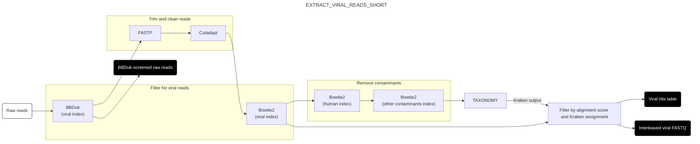
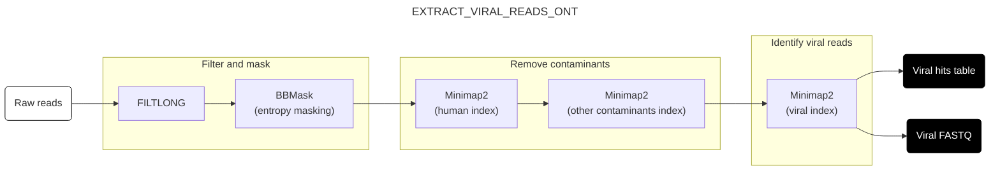

# RUN WORKFLOW

This page describes the structure and function of the `run` workflow, which is responsible for the primary analysis of the pipeline. For usage instructions, see [here](./usage.md).

## Workflow structure

At a high level, the `run` workflow carries out two main analyses on raw input reads: sensitive and specific identification of vertebrate-infecting viral reads[^vertebrate], and high-level taxonomic profiling. Optionally, it can also perform BLAST validation on putative vertebrate-infecting viral reads; however, this is slow and expensive and not performed by default.

[^vertebrate]: We say "vertebrate-infecting viruses" here and throughout the documentation for convenience, as the pipeline currently looks for vertebrate-infecting viruses by default. However, which viruses the pipeline looks for is configurable based on how you set up the index workflow.

To perform these functions, the workflow runs a series of subworkflows responsible for different tasks:

1. [Setup subworkflows](#setup-subworkflows): Prepare the input data for analysis
    - [Load data into channels (LOAD_SAMPLESHEET)](#load-data-into-channels-load_samplesheet)
    - [Subset and trim reads (SUBSET_TRIM)](#subset-and-trim-reads-subset_trim)
2. [Helper subworkflows](#helper-subworkflows): Helper workflows that are used by other subworkflows in this list
    - [Taxonomic assignment (TAXONOMY)](#taxonomic-assignment-taxonomy)
    - [QC (QC)](#qc-qc)
3. [Analysis subworkflows](#analysis-subworkflows): Perform the primary analysis
    - An EXTRACT_VIRAL_READS subworkflow that depends on the read type
        - [Viral identification for Illumina reads and other short reads (EXTRACT_VIRAL_READS_SHORT)](#viral-identification-short-read-version)
        - [Viral identification for ONT reads and other long reads (EXTRACT_VIRAL_READS_ONT)](#viral-identification-ont-version)
    - [Taxonomic profiling (PROFILE)](#taxonomic-profiling-profile)
    - [BLAST validation (BLAST_VIRAL)](#blast-validation-blast_viral)
4. [QC subworkflows](#qc-subworkflows): Conduct quality control on the analysis results
    - [Count total reads (COUNT_TOTAL_READS)](#count-total-reads-count_total_reads)
    - [QC and output (RUN_QC)](#qc-and-output-run_qc)

## Setup subworkflows

### Load data into channels (LOAD_SAMPLESHEET)
This subworkflow loads the samplesheet and creates a channel containing the samplesheet data, in the structure expected by the pipeline. It also derives the endedness for the pipeline run (single- vs paired-end) from the structure of the samplesheet, and checks that the specified sequencing platform is (a) valid and (b) compatible with the specified endedness. (No diagram is provided for this subworkflow.)

### Subset and trim reads (SUBSET_TRIM)
This subworkflow uses [Seqtk](https://github.com/lh3/seqtk) to randomly subsample the input reads to a target number[^target] (default 1 million read pairs per sample) to save time and and compute on downstream steps while still providing a reliable statistical picture of the overall sample. Following downsampling, read pairs are combined into a single interleaved file, which then undergoes adapter trimming and quality screening with [FASTP](https://github.com/OpenGene/fastp).

[^target]: More precisely, the subworkflow uses the total read count and target read number to calculate a fraction *p* of the input reads that should be retained, then keeps each read from the input data with probability *p*. Since each read is kept or discarded independently of the others, the final read count will not exactly match the target number; however, it will be very close for sufficiently large input files.

## Helper workflows

### Taxonomic assignment (TAXONOMY)

This subworkflow performs taxonomic assignment on a set of reads using [Kraken2](https://ccb.jhu.edu/software/kraken2/). It is called by both the [PROFILE](#taxonomic-profiling-profile) and [EXTRACT_VIRAL_READS](#viral-identification-extract_viral_reads) subworkflows.

1. Input read pairs are processed with [BBMerge](https://jgi.doe.gov/data-and-tools/software-tools/bbtools/bb-tools-user-guide/bbmerge-guide/)[^merge] to create single sequences. Any pairs that cannot be merged are joined end-to-end with an "N" base between them.
2. Reads are taxonomically classified using [Kraken2](https://ccb.jhu.edu/software/kraken2/) with the reference database from the index workflow. 
3. [Bracken](https://ccb.jhu.edu/software/bracken/) then processes these results to generate detailed taxonomic abundance estimates.
4. Finally, the outputs from Kraken2 and Bracken are processed and combined into well-formatted TSVs for downstream processing.

[^merge]: Which aligns and merges read pairs with significant overlap.

### QC (QC)
This phase conducts quality control on any set of reads. It is called by [RUN_QC](#qc-and-output-run_qc) twice, once for the subset reads and once for the subset trimmed reads.

1. Input reads are run through [FASTQC](https://www.bioinformatics.babraham.ac.uk/projects/fastqc/) to generate quality-control metrics.
2. The output of FASTQC is then run through [MultiQC](https://multiqc.info/) to extract QC information into a more usable form.
3. The output of MultiQC is then processed and summarized into a series of summary TSV files.

## Analysis subworkflows

### Viral identification (short read version)
#### EXTRACT_VIRAL_READS_SHORT

The goal of this subworkflow is to sensitively, specifically, and efficiently identify reads arising from host-infecting viruses. It takes as input paired-end short-reads and uses a multi-step process designed to keep computational costs low while minimizing false-positive and false-negative errors.

1. To begin with, the raw reads are screened against a database of vertebrate-infecting viral genomes generated from Genbank by the index workflow. This initial screen is performed using [BBDuk](https://jgi.doe.gov/data-and-tools/software-tools/bbtools/bb-tools-user-guide/bbduk-guide/), which flags any read that contains at least one 24-mer matching any vertebrate-infecting viral genome. The purpose of this initial screen is to rapidly and sensitively identify putative vertebrate-infecting viral reads while discarding the vast majority of non-viral reads, reducing the cost associated with the rest of this phase.
2. Surviving reads undergo adapter and quality trimming with [FASTP](https://github.com/OpenGene/fastp) and [Cutadapt](https://cutadapt.readthedocs.io/en/stable/) to remove adapter contamination and low-quality/low-complexity reads.
3. Next, reads are aligned to the previously-mentioned database of vertebrate-infecting viral genomes with [Bowtie2](https://bowtie-bio.sourceforge.net/bowtie2/index.shtml) using quite permissive parameters designed to capture as many putative vertebrate viral reads as possible. The output files are processed to generate new read files containing any read pair for which at least one read matches the vertebrate viral database.
4. The output of the previous step is passed to a further filtering step, in which reads matching a series of common contaminant sequences are removed. This is done by aligning surviving reads to these contaminants using Bowtie2 in series. Contaminants to be screened against include reference genomes from human, cow, pig, carp, mouse and *E. coli*, as well as various genetic engineering vectors.
5. Surviving read pairs are then taxonomically profiled using the [TAXONOMY subworkflow](#taxonomic-assignment-taxonomy) to generate Kraken2 taxonomic assignments.
6.  Finally, reads are assigned a final vertebrate-infecting virus status if they:
    - Are classified as vertebrate-infecting virus by both Bowtie2 and Kraken2; or
    - Are unassigned by Kraken and align to an vertebrate-infecting virus taxon with Bowtie2 with an alignment score above a user-specifed threshold[^threshold].

[^threshold]: Specifically, Kraken-unassigned read pairs are classed as vertebrate viral if, for either read in the pair, S/ln(L) >= T, where S is the best-match Bowtie2 alignment score for that read, L is the length of the read, and T is the value of `params.bt2_score_threshold` specified in the config file.

### Viral identification (ONT version) 
#### EXTRACT_VIRAL_READS_ONT

The goal of this subworkflow is to sensitively, specifically, and efficiently identify reads arising from host-infecting viruses. It takes as input ONT (oxford nanopore) reads. Due to the smaller size of ONT datasets compared to most short-read datasets, EXTRACT_VIRAL_READS_ONT currently uses a simpler workflow than EXTRACT_VIRAL_READS_SHORT, and is less optimized for low computational costs. 

1. First, reads are filtered for length and quality with [Filtlong](https://github.com/rrwick/Filtlong), and low-complexity regions are masked with [BBMask](https://archive.jgi.doe.gov/data-and-tools/software-tools/bbtools/bb-tools-user-guide/bbmask-guide/) (entropy masking).
2. Next, common contaminant sequences are removed, by aligning reads to contaminants with [Minimap2](https://github.com/lh3/minimap2) in a series. Contaminants to be screened against include reference genomes from human, cow, pig, carp, mouse and *E. coli*, as well as various genetic engineering vectors.
    - Note that, unlike for EXTRACT_VIRAL_READS_SHORT, contaminant removal is done before viral read identification. EXTRACT_VIRAL_READS_ONT is frequently used on swab samples (not just on wastewater samples); we avoid analyzing human reads from swab samples for privacy/compliance reasons, so we wish to discard human reads as early in the workflow as possible.
3. Finally, reads are aligned to our database of vertebrate-infecting viral genomes using Minimap2. (As noted above, the viral database is generated from Genbank by the index workflow.)

### Taxonomic profiling (PROFILE)

The goal of this subworkflow is to give an overview of the taxonomic composition of the cleaned and subset reads from the preprocessing phase. In particular, it gives an estimate of (a) the fraction of ribosomal reads in the dataset, (b) the taxonomic breakdown of the dataset at the domain level[^eukarya], and (c) more detailed abundance estimates for lower-level taxa.

To do this, reads from SUBSET_CLEAN are separated into ribosomal and non-ribosomal read groups using BBDuk, by searching for ribosomal k-mers from the SILVA database generated by the index workflow. The ribosomal and non-ribosomal reads are then passed separately to [TAXONOMY workflow](#taxonomic-assignment-taxonomy), which returns back the Kraken2 and Bracken outputs. These are then annotated and merged across samples to produce single output files.

[^eukarya]: As human is the only eukaryotic genome included in the Standard reference database for Kraken2, all sequences assigned to that domain can be assigned to *Homo sapiens*.

### *Optional: BLAST validation phase (BLAST_VIRAL)*

To evaluate the performance of the process described in the viral identification phase, it's useful to get some ground-truth information about whether the host viral assignments made in that subworkflow are correct. To do this, we use [BLASTN](https://blast.ncbi.nlm.nih.gov/Blast.cgi) to align the putative host viral reads output by the previous phase against the `core_nt` database, then process the output to check whether each sequence had a high-scoring alignment to at least one vertebrate viral sequence. For computational tractability, this can be performed on only a subset of surviving vertebrate viral reads (specified by `params.blast_viral_fraction`)[^blast].

1. Input FASTQ files are subset as appropriate (based on `params.blast_viral_fraction`), then converted to FASTA.
2. Reads in FASTA format are aligned to the specified NCBI database (default `core_nt`) with BLASTN.
3. Tabular BLASTN outputs are filtered to keep only the best-scoring alignment for each combination of read and subject sequence, then filtered again to keep only alignments for each read that (a) are in the top N alignments for that read (default N=5), or (b) have a bitscore at least P% as high as the best-scoring alignment (default P=90).

[^blast]: Setting `params.blast_viral_fraction` to 0 skips this step altogether.

## QC workflows

### Count total reads (COUNT_TOTAL_READS)
This subworkflow counts the total number of reads in the input files, then merges read counts from all samples into one output TSV. (No diagram is provided for this subworkflow.)

### QC and output phase (RUN_QC)
This subworkflow calls [QC](#qc-qc) on the raw and cleaned read subsets output by SUBSET_TRIM, then concatenates the outputs across the two pipeline stages.

