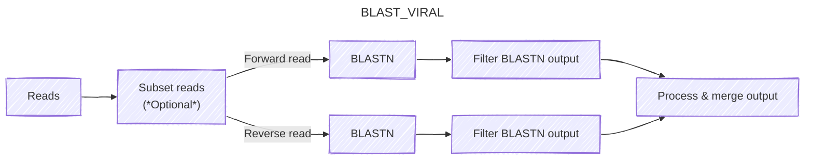

# Run validation

## BLAST validation phase (BLAST_VIRAL)

To evaluate the performance of the process described in the viral identification phase, it's useful to get some ground-truth information about whether the host viral assignments made in that subworkflow are correct. To do this, we use [BLASTN](https://blast.ncbi.nlm.nih.gov/Blast.cgi) to align the putative host viral reads output by the previous phase against the `core_nt` database, then process the output to check whether each sequence had a high-scoring alignment to at least one HV sequence. For computational tractability, this can be performed on only a subset of surviving host viral reads (specified by `params.blast_hv_fraction`)[^blast].

1. Reads are subset if `params.blast_hv_fraction` is less than 1.
2. Forward and reverse reads are aligned separately with BLASTN.
3. BLASTN outputs are filtered to keep only the best-scoring alignment for each read.
4. Output from both reads are combined into a single file, with columns for the read ID, the subject taxid, and the alignment score.

[^blast]: Setting `params.blast_hv_fraction` to 0 skips this step altogether.