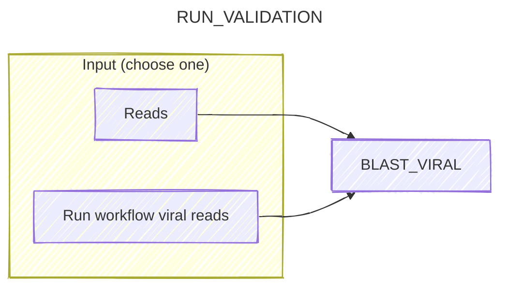
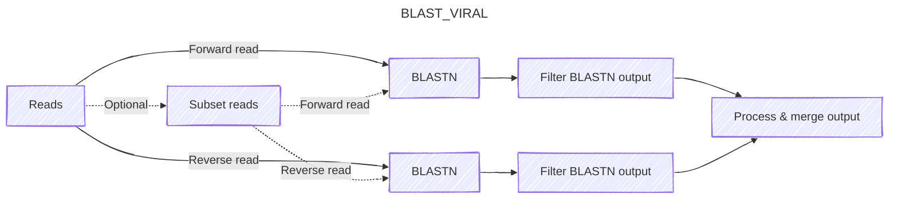

# Run validation

This pipeline allows you to run BLAST validation on the output of the RUN workflow or on any reads. We use [BLASTN](https://blast.ncbi.nlm.nih.gov/Blast.cgi) to align the putative host viral reads output by the previous phase against the `core_nt` database, then process the output to check whether each sequence had a high-scoring alignment to at least one host viral sequence.

1. Reads can be provided using the output of the host viral identification phase of the RUN workflow, or directly from the user.
2. Run the [BLAST_VIRAL](#blast-validation-phase-blast_viral) subworkflow, which BLASTS the forward and reverse reads separately and then merges the results.

## BLAST validation phase (BLAST_VIRAL)

To evaluate the performance of the process described in the viral identification phase, it's useful to get some ground-truth information about whether the host viral assignments made in that subworkflow are correct. For computational tractability, this can be performed on only a subset of surviving host viral reads (specified by `params.blast_hv_fraction`)[^blast].

1. Reads are subset if `params.blast_hv_fraction` is less than 1, else if `params.blast_hv_fraction` is 1, then BLAST is run on all host viral reads.
2. Forward and reverse reads are aligned separately with BLASTN.
3. BLASTN outputs are filtered to keep only the best-scoring alignment for each read.
4. Output from both reads are combined into a single file, with columns for the read ID, the subject taxid, and the alignment score.

[^blast]: Setting `params.blast_hv_fraction` to 0 skips this step altogether.